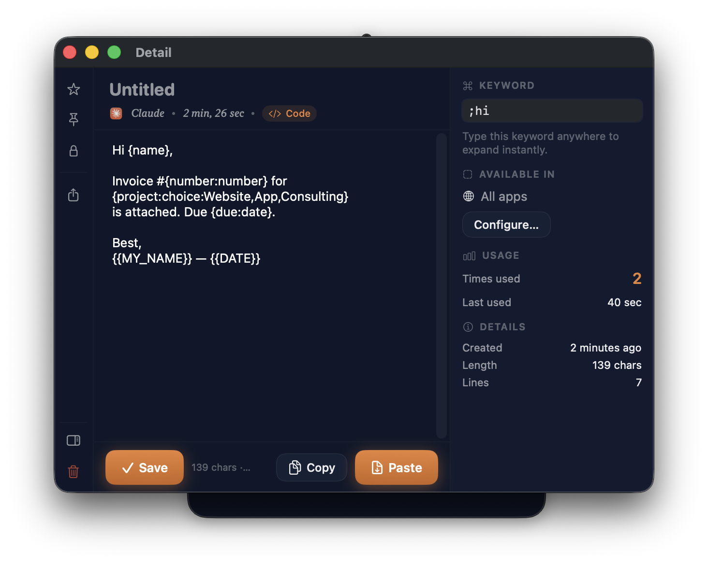
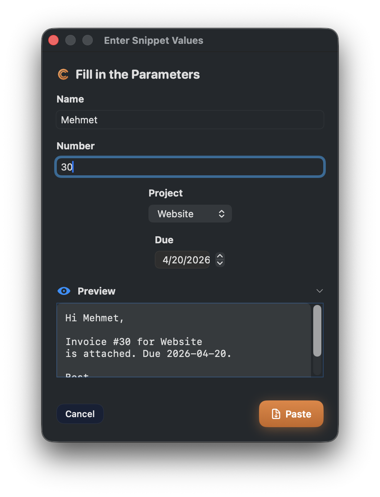
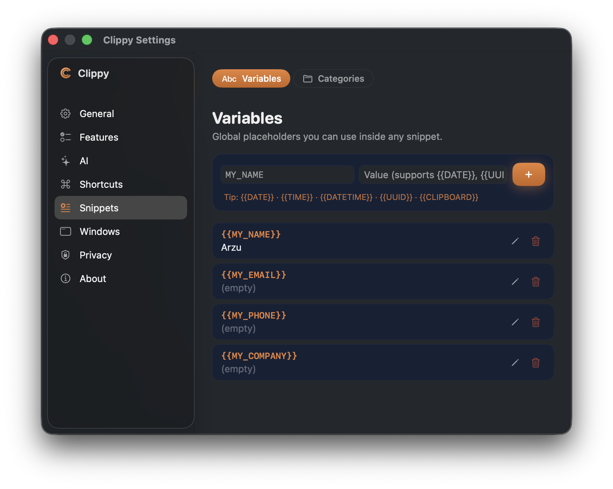

# Clippy

> macOS用の温かくパワフルなクリップボードマネージャー。カードベースの履歴、
> スマートなコンテンツ検出、内蔵スクリーンショットエディター、Dockプレビュー、
> AI駆動のテキスト変換 — すべてローカル、オープンソース、無料。

<p align="center">
  
</p>

<p align="center">
  <a href="https://github.com/yarasaa/Clippy/releases/latest">
    
  </a>
  <a href="https://github.com/yarasaa/Clippy/blob/main/LICENSE">
    
  </a>
  
  <a href="https://buymeacoffee.com/12hrsofficp">
    
  </a>
</p>

**🌐** [English](README.md) · [Türkçe](README.tr.md) · [日本語](README.ja.md) · [简体中文](README.zh.md)

> 🌐 This is a translation of the [canonical English README](README.md).
> The app's UI is currently in English — Clippy uses minimal, icon-rich
> labels that are easy to follow regardless of your language.

---

## Clippyを選ぶ理由

コピーしたもの — テキスト、画像、コード、カラー、URL — は通常、
クリップボードに一瞬だけ残ってすぐ消えてしまいます。Clippyはそれらを
すべて保持します。メニューバーに美しい履歴として並べ、検索、スター、
ピン留め、ホットキーでの貼り付けができます。さらに、スクリーンショットへの
注釈、ファイル形式の変換、Shelfでのファイル保管、ローカル/クラウドAIによる
テキスト変換まで行えます。

すべて**あなたのMacの中だけ**で完結します。アカウント登録なし。
クラウド送信なし。テレメトリなし。

## ✨ 機能一覧

| | |
|---|---|
| 📋 **スマートなクリップボード履歴** — URL、カラー、JSON、コード、画像のコンテンツ認識プレビュー |  |
| 🎯 **ホバーアクション** — Paste、Star、Pin、AI変換が必要な瞬間に現れる |  |
| ⚡ **Quick Preview** — ホットキーでフローティングオーバーレイから最近のアイテムを貼り付け |  |
| ✍️ **スクリーンショットエディター** — Studio Bar、コンテキスト対応Inspector、20以上の注釈ツール |  |
| 🪟 **Dockプレビュー** — Windows 11風のサムネイル、ライブストリーミングと番号バッジ |  |
| ✨ **AI変換** — 要約、翻訳、文法修正、コード説明。Ollamaでローカル、またはクラウド (APIキー持ち込み) |  |
| 🧩 **自動展開スニペット** — キーワードで保存、どこでも呼び出し可能 |  |
| 🗂 **ファイルコンバーター** — 画像、ドキュメント、音声、動画、データ形式。ドラッグ、ドロップ、変換 |  |
| 📦 **Shelf** — アプリ間で手元に置いておきたいファイル用の専用引き出し |  |
| 🔐 **暗号化アイテム** とタイプ別フィルター — 機密エントリをロック、タイプで絞り込み |  |

---

## 主要機能

### スマートなクリップボード履歴

コピーされたすべてがタイプに応じて賢くレンダリングされます:

- **テキスト** はソースアプリ、時間、先頭数行を表示
- **URL** はホストチップと完全URLプレビュー
- **カラー** はライブスウォッチとHEX
- **コード** は言語チップと等幅フォントで表示
- **JSON** は構造を一行に折りたたみ
- **画像** は寸法情報付きのフルブリードサムネイル

<p align="center">
  
</p>

カードにホバーすると、変換、スター、ピン、貼り付けアクションが現れます。

<p align="center">
  
</p>

### ライブ検索

入力して即座にフィルター。プレースホルダーはアクティブなタブに合わせて
変わります (Search clipboard… / Search snippets… / Search images…)。
常に何を検索しているか分かります。

<p align="center">
  
</p>

### ピン留め & スター

ピン留めされたアイテムはRecentストリームの上に浮かび、大切なものを
失うことはありません — 機密項目用のClippyの **暗号化コンテンツ** も含めて。

<p align="center">
  
</p>

長期保存したいものをスターして、Starredタブでそれだけを表示。

<p align="center">
  
</p>

### タイプ別フィルター

上部のタブでリストを単一のコンテンツタイプに絞り込み — All、
**Images**、Snippets、Starred。

<p align="center">
  
</p>

### 自動展開スニペット

任意のテキストをキーワード付きの再利用可能なスニペットとして保存できます。
Macのどこでも `;keyword` と入力すると、Clippyがトリガーを検出して削除し、
展開された内容を貼り付けます。TextExpanderと同じ動きが、内蔵で無料で
使えます。

<p align="center">
  
</p>

各スニペットには専用の詳細ウィンドウがあります。キーワード、対象アプリ、
テンプレート本文、使用状況の統計 (起動回数、最終使用時刻) がすべて
一画面で確認できます。

<p align="center">
  
</p>

**動的プレースホルダー** — 貼り付けの瞬間に自動で解決されます:

| プレースホルダー | 展開される値 |
|---|---|
| `{{DATE}}` | 今日の日付 `yyyy-MM-dd` |
| `{{TIME}}` | 現在時刻 `HH:mm:ss` |
| `{{DATETIME}}` | 日時 `yyyy-MM-dd HH:mm` |
| `{{UUID}}` | 新しいランダムUUID |
| `{{CLIPBOARD}}` | 最新のクリップボードテキスト |
| `{{RANDOM:1-100}}` | 指定範囲のランダムな整数 |
| `{{FILE:~/notes.txt}}` | ローカルファイルの内容 |
| `{{SHELL:date +%s}}` | シェルコマンドの出力 |
| `{{MY_NAME}}` | Settings → Snippetsで定義したカスタム変数 |
| `{{;other}}` | 他のスニペットをキーワードで呼び出す (ネスト、最大5階層) |

**入力フォーム付きパラメータ** — 単一波括弧で貼り付け時に簡易フォームを
表示:

```
{name}様、

{project:choice:Website,App,Consulting} の請求書 #{number:number} を
添付しました。お支払い期限: {due:date}。

{signature=よろしくお願いいたします。\nMehmet}
```

`;invoice` と入力するとテキストフィールド、数値入力、ドロップダウン、
日付ピッカー、そして事前入力された署名を含む短いダイアログが開きます。
下部のライブ **Preview** は入力中の最終テキストをリアルタイムで表示。
**Paste** を押すと各プレースホルダーが置換され、フォーカス中のアプリに
挿入されます。

<p align="center">
  
</p>

サポートされるパラメータタイプ:
`{name}`、`{name:text}`、`{name:number}`、`{name:date}`、`{name:time}`、
`{name:choice:A,B,C}`、そしてデフォルト値を事前設定する `{name=default}`。

**グローバル変数** — **Settings → Snippets → Variables** で再利用可能な
プレースホルダーを一度定義すれば (`{{MY_NAME}}`、`{{MY_EMAIL}}`、
`{{MY_COMPANY}}` など)、どのスニペットからも参照できます。変数を一度
変更するだけで、すべてのスニペットが新しい値を自動的に反映します。

<p align="center">
  
</p>

**アプリ別スコープ** — スニペットを特定のアプリ (例: Mail + Outlook) に
紐づけて、意図した場所でのみ `;signature` が発動するようにできます。

**ネスト構成** — 小さなスニペットを組み合わせてより長いテンプレートを
構築 (メール本文の中に `{{;greeting}}` + `{{;signature}}` など)。

**利用状況の記録** — Clippyは各スニペットの使用回数を記録し、detail
inspectorからよく使うスニペットを一目で確認できます。

<p align="center">
  
</p>

### 右クリックのパワーメニュー

すべてのカードには豊富なコンテキストメニュー: コピー、貼り付け、共有、
カラー形式変換、スター、ピン、暗号化、画像結合、削除。

<p align="center">
  
</p>

### AIテキスト変換

任意のクリップボードアイテムで実行: 要約、展開、文法修正、翻訳 (30以上の
言語)、箇条書き、メール作成、コード用のアクション (説明、コメント追加、
バグ検出、最適化)。

プロバイダーを選択:

- **Ollama** — 完全ローカル、無料、プライベート
- **OpenAI**、**Anthropic**、**Google Gemini** — 自分のAPIキー

内蔵テキストユーティリティも: Base64エンコード/デコード、大文字小文字変換、
JSONフォーマット/ミニファイ、重複行削除、行結合。

<p align="center">
  
</p>

### 詳細ウィンドウ — アクションレール + インスペクター

任意のアイテムをクリックすると詳細ウィンドウが開きます。左: 永続的な
アクションレール (スター、ピン、暗号化、共有、削除)。中央: リッチエディター。
右: コンテキスト対応インスペクター (キーワード、アプリスコープ、使用統計)。

<p align="center">
  
</p>

コンテンツタイプによって異なる表示 — JSONはツリービュー、Valid JSONバッジ、
Raw切替ボタン付き。

<p align="center">
  
</p>

カラーには専用カード: 光るスウォッチとHEX、RGB、HSL間を変換するワンタップ
Copyメニュー。

<p align="center">
  
</p>

### Quick Previewオーバーレイ

Quick Previewホットキー (デフォルト **⌘⌥V**) をどこでも押すと、フローティング
パネルに最新10アイテムを表示。`1`-`9` キーで直接貼り付け、`↑↓` でナビゲート、
`esc` で閉じる。

<p align="center">
  
</p>

### スクリーンショットエディター — "Studio"

内蔵エディターには独自のデザイン言語があります。左にツールレール、中央に
ライブキャンバス、右に **コンテキスト対応インスペクター** — アクティブな
ツールのプロパティ、または選択された注釈の詳細を表示します。

<p align="center">
  
</p>

20以上のツール、すべてライブ構成可能:

- 5つの矢印スタイルと5つのストロークパターンを持つArrow
- 太字/斜体/配置、コントラスト対応背景、ボックスサイズのText
- 3つのブラシスタイル (solid/dashed/marker) を持つPen
- 角丸、塗りつぶしモード、グラデーションの図形
- 矢印/矩形/楕円を手描き風にするSketchモード
- ブラー、ピクセル化、スポットライト、ピン (番号マーカー)、絵文字、拡大鏡、定規
- ピクセル精度のルーペと9つのカラー形式コピーオプションを持つスポイト
- エフェクト: 背景パディング、影、角丸、境界線、透かし

### Shelf

複数のアプリを行き来するときに、手元に置いておきたいファイル用の専用ドロワーです —
ダウンロード、添付ファイル、モックアップ、PDFなど。どこからでもファイルをShelfに
ドラッグして保管し、必要なときに取り出せます。タイプバッジ (PDF / ZIP / フォルダ /
画像サイズ) と一括操作に対応しています。

<p align="center">
  
</p>

### ファイルコンバーター

ファイルをドラッグ、出力形式を選択、一括変換:

- **画像:** PNG、JPEG、TIFF、BMP、GIF、HEIC、WEBP、PDF
- **ドキュメント:** RTF、HTML、TXT、PDF、Markdown、DOCX
- **音声:** M4A、WAV、AAC、AIFF、MP3、FLAC、CAF
- **動画:** MOV、MP4、M4V、AVI
- **データ:** JSON、YAML、XML、CSV、PLIST

<p align="center">
  
</p>

### Dockプレビュー & アプリスイッチャー

Dockの任意のアプリにホバーしてWindows 11風のサムネイルを表示 — 番号付きの
キーボードヒント、インラインタイトルバー、そして (オプションで) 5FPSの
ライブストリーミング。

<p align="center">
  
</p>

---

## 設定

NavigationSplitViewベースの単一Settingsウィンドウからすべてを構成可能 —
General、Features、AI、Shortcuts、Snippets、Windows、Privacy、About。

### General

ログイン時に起動、テーマ、ポップオーバーサイズ、表示タブ、自動更新チェック。

<p align="center">
  
</p>

### Features

詳細な切り替え: 自動コード検出、コンテンツ検出、重複スキップ、ソースアプリ
追跡、スクリーンショットエディター、OCR、ファイルコンバーター、Shelf、
Quick Preview。

<p align="center">
  
</p>

### AI

プロバイダー (Ollama、OpenAI、Anthropic、Google Gemini) を選択、APIキーを
貼り付け、モデルを選択、接続をテスト。下部のavailable actionsはClippyが
カードで提供する内容を正確に示します。

<p align="center">
  
</p>

### Shortcuts

すべてのホットキーを再バインド — Show/Hide、Paste Selected、Quick Preview、
Sequential Copy/Paste、Clear Queue、Screenshot、App Switcher。

<p align="center">
  
</p>

### Windows (Dockプレビュー)

Dockプレビューを調整: アニメーションスタイル、プレビューサイズ、ホバー遅延、
トラックパッドジェスチャー、ウィンドウキャッシュ、最大キャッシュサイズ。

<p align="center">
  
</p>

---

## インストール

### DMGをダウンロード

1. **[Releases](https://github.com/yarasaa/Clippy/releases/latest)** から最新の `.dmg` を取得
2. ダブルクリックして **Clippy.app** を `/Applications` にドラッグ
3. 起動 — 短いオンボーディングがセットアップを案内します

<p align="center">
  
</p>

### 自動更新

Clippyには [Sparkle](https://sparkle-project.org/) が同梱されています。
新しいバージョンは24時間ごとにバックグラウンドでチェックされるか、
**Settings → General → Check Now** で手動チェック。更新は暗号的に
署名されているため (EdDSA)、本物のClippyだけがあなたのインストールに
更新をプッシュできます。

### ソースからビルド

```bash
git clone https://github.com/yarasaa/Clippy.git
cd Clippy
open Clippy.xcodeproj
# Xcodeで Product → Run (⌘R)
```

要件: macOS 13+、Xcode 16+、Swift 5.9+。

---

## キーボードショートカット

すべて **Settings → Shortcuts** から再バインド可能。

| アクション | デフォルト |
|---|---|
| Clippyポップオーバーの表示/非表示 | `⌘⇧V` |
| Quick Previewオーバーレイ | `⌘⌥V` |
| 選択したものすべてを貼り付け | `⌘⏎` |
| Sequential Copy | `⌘⇧C` |
| Sequential Paste | `⌘⇧V` (上書き) |
| スクリーンショット撮影 | `⌘⇧S` |
| App Switcher | `⌘⇥` (有効時) |

Quick Previewオーバーレイには独自のナビゲーションキーがあります —
`1`-`9` で貼り付け、`↑↓` で移動、`esc` で閉じる。

---

## プライバシー

Clippyはすべてをあなたのユーザーアカウント下のMac、CoreDataに保存します。

- **ネットワーク呼び出しなし**、以下を除く:
  - オプションのAI変換 (有効化した場合のみ、選択したプロバイダーにのみ —
    Ollamaは完全ローカル)
  - `raw.githubusercontent.com/yarasaa/Clippy` への自動更新チェック
- **アナリティクス、テレメトリ、アカウントシステムなし**
- **ソースアプリの追跡** はSettings → Featuresで無効化可能
- **暗号化アイテム** — 機密クリップボードエントリをロック、認証するまで
  "Encrypted content" として表示される

完全な内訳は [PRIVACY.md](PRIVACY.md) (近日公開) をご覧ください。

---

## 貢献

Clippyはオープンソースで、コミュニティからの貢献を歓迎します。

- バグ / 機能リクエスト: [GitHub Issues](https://github.com/yarasaa/Clippy/issues)
- コード貢献: fork、branch、`main` へのPR
- 大きな変更: まずissueを開いて方向性を議論

リリース (メンテナーのみ) — [docs/SPARKLE_SETUP.md](docs/SPARKLE_SETUP.md) を参照。

---

## クレジット

- **Sparkle** — 自動更新フレームワーク
- **HotKey** — グローバルキーボードショートカット
- **Ollama**、**OpenAI**、**Anthropic**、**Google** — AIアクセス
- バグを報告し、ビルドをテストし、Ember再設計を推進してくれたすべての方々

## サポート

Clippyがあなたの生活を楽にしているなら、コーヒー一杯で継続できます:

<p align="center">
  <a href="https://buymeacoffee.com/12hrsofficp">
    
  </a>
</p>

---

## ライセンス

MIT — [LICENSE](LICENSE) を参照。
