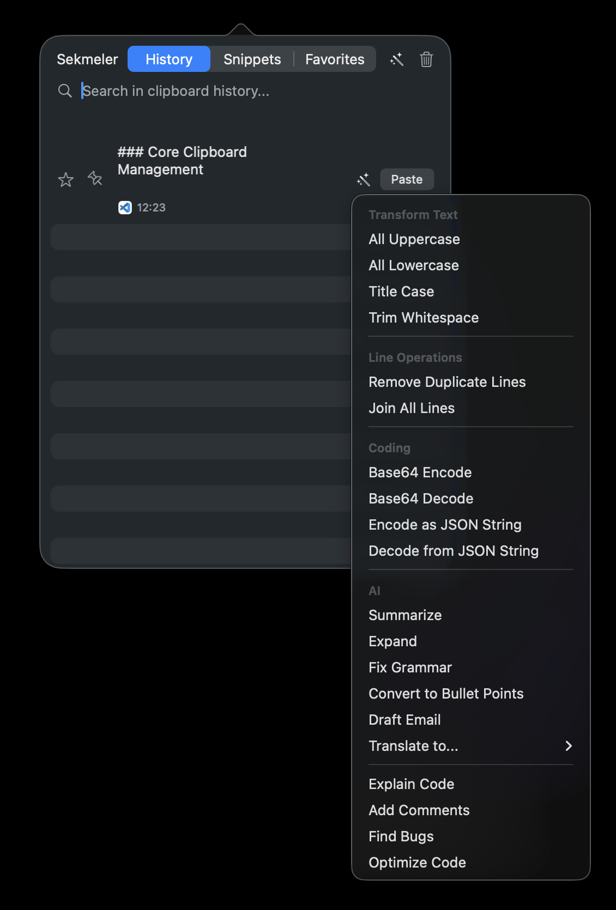
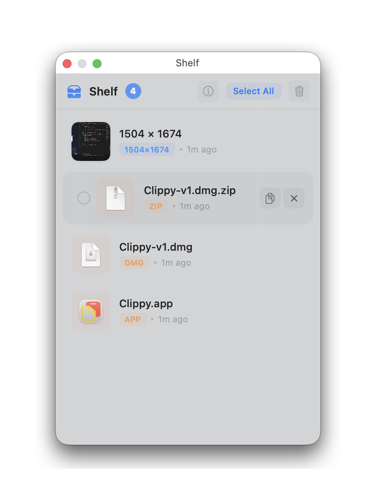
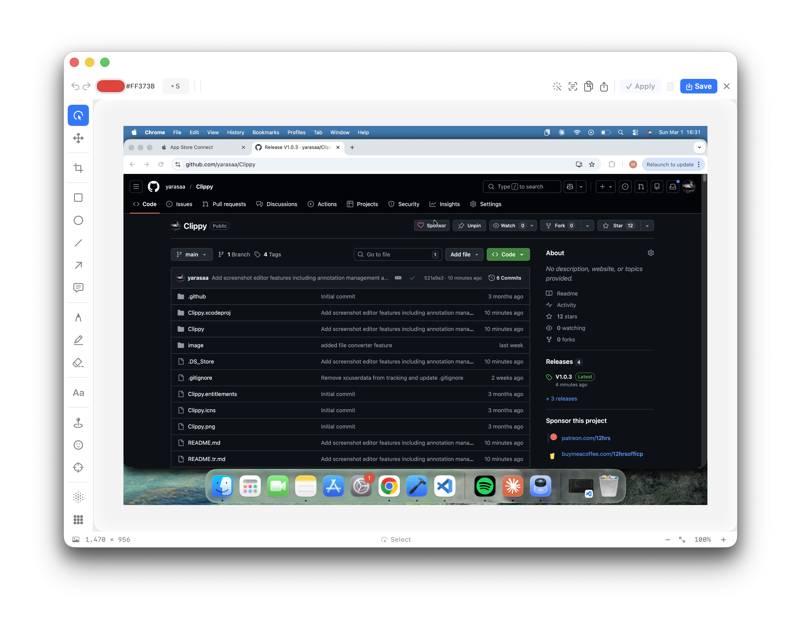

# Clippy for macOS

<p align="center">
  <a href="https://buymeacoffee.com/12hrsofficp" target="_blank"></a>
</p>

Clippy is a powerful macOS menu bar application designed for developers and heavy text users to manage their clipboard history. It saves everything you copy, allowing you to quickly access, edit, and use your clipboard items.









✨ Features

### 📋 Core Clipboard Management

- **History Recording:** Automatically saves all text and images you copy.
- **Quick Access & Interface:** Instantly access your clipboard history by clicking the menu bar icon or using a keyboard shortcut.
- **Search:** Instantly search through your entire history.
- **Favorites:** Star your frequently used items to prevent them from being deleted and find them quickly.
- **Code Detection:** Automatically detects if copied text is code and organizes it in a separate "Code" tab.
- **Custom Titles:** Add a custom title to any clipboard item for easier identification. Titles can be edited in the detail view and are prominently displayed above the content in the main list.
- **Source App Icons:** Easily track where each item was copied from with icons of the source application.

### 🚀 Advanced Functionality

- **Pinning:** Pin important items you're working on to the top of the list, keeping them there even as new items are copied.
- **Multi-Select:** Select multiple items by holding down the `Cmd (⌘)` key.
- **Paste All:** Paste all selected text items at once, separated by new lines.
- **Diff Viewer:** Compare two selected text items side-by-side with character-level highlighting of differences.
- **Drag & Drop:** Drag a single item or multiple selected text items from the list and drop them into any application.
- **Sequential Paste:**
  - **With Shortcut:** Copy multiple items in sequence with `Cmd+Shift+C`. Then, paste them one by one in the same order using `Cmd+Shift+B`.
  - **With Visual Selection:** Select your desired items from the list with `Cmd` and press the **"Add to Queue"** button at the bottom. The menu bar icon will update to show the queue status (e.g., "1/5").
- **Combine Images:** Select multiple images with `Cmd`, right-click, and combine them into a single new image, either vertically or horizontally.
- **Direct Paste:** Paste directly into the active application using the "Paste" button next to each item.

### 🔮 Quick Preview Overlay

A floating overlay panel that gives you instant access to your most recent clipboard items without opening the main window.

- **Hotkey Activated:** Press `Cmd+Option+V` (customizable) to toggle the overlay from anywhere.
- **Recent Items:** Shows your last N clipboard items (configurable 3-15, default 10).
- **Click to Paste:** Click any item to paste it directly into the previously active application.
- **Drag & Drop:** Drag items from the overlay directly into any application.
- **Keyboard Navigation:** Press `ESC` to dismiss the overlay.
- **Auto-close:** Automatically closes after pasting (configurable in Settings).
- **Liquid Glass Design:** Modern translucent design that adapts to Light/Dark mode with smooth animations.
- **Draggable Panel:** Drag the panel by its header to reposition it on screen.

### 🤖 AI Smart Paste

Transform your clipboard content with AI-powered text processing. Supports multiple providers including free local options.

#### Supported Providers

| Provider          | Cost             | Notes                                                |
| ----------------- | ---------------- | ---------------------------------------------------- |
| **Ollama**        | Free (Local)     | Runs on your machine. Install from ollama.com        |
| **OpenAI**        | API Key Required | GPT-4o Mini, GPT-4o, GPT-4.1, o3-mini                |
| **Anthropic**     | API Key Required | Claude Sonnet 4.5, Claude Haiku 4.5, Claude Opus 4.6 |
| **Google Gemini** | API Key Required | Gemini 2.0 Flash, Gemini 2.5 Pro, Gemini 2.5 Flash   |

#### Available AI Actions

**Text Transformations:**

- **Summarize** - Condense long text into a concise summary
- **Expand** - Elaborate on short text while keeping the same tone
- **Fix Grammar** - Correct grammar, spelling, and punctuation errors
- **Translate** - Translate to 30+ languages (English, Turkish, Spanish, French, German, Italian, Portuguese, Russian, Chinese, Japanese, Korean, Arabic, Hindi, and more)
- **Bullet Points** - Convert text into organized bullet points
- **Draft Email** - Transform notes into professional email format
- **Free Prompt** - Write your own custom instructions for the AI

**Code Operations (appears for code items):**

- **Explain Code** - Get a clear explanation of what the code does
- **Add Comments** - Automatically add helpful comments to code
- **Find Bugs** - Analyze code for potential bugs and issues
- **Optimize Code** - Get an optimized version with better performance

#### How to Use

1. Go to **Settings > AI** and enable AI features.
2. Choose your provider and configure your API key (or Ollama URL).
3. Use the **Test Connection** button to verify your setup.
4. In the main list, click the wand icon (`✨`) on any text item to access AI actions.
5. Results appear in a popover with **Copy Result** and **Replace Original** buttons.

### 📁 File Format Converter

A built-in file format converter that lets you quickly convert files between formats without leaving Clippy. No third-party dependencies — all conversions use native macOS APIs.

- **Separate Floating Window:** Opens as its own window, accessible from the menu bar. Optionally pin it on top with the pin button.
- **Drag & Drop:** Drag files directly into the left panel, or use the file picker to add multiple files at once.
- **Dynamic Format Options:** The right panel shows available output formats based on the selected file's type.
- **Custom Output Names:** Rename output files directly in the converter before converting.
- **Batch Conversion:** Convert all files at once with "Convert All", or just the selected file with "Convert Selected".
- **Per-File Progress:** Each file shows its own progress bar and percentage during conversion.
- **Choose Save Location:** Pick the output folder before conversion starts.

#### Supported Formats

| Category     | Input Formats                                   | Output Formats                       |
| ------------ | ----------------------------------------------- | ------------------------------------ |
| **Image**    | PNG, JPEG, TIFF, BMP, GIF, HEIC, ICO, SVG, WEBP | PNG, JPEG, TIFF, BMP, GIF, HEIC, PDF |
| **Document** | RTF, HTML, TXT, RTFD, Markdown, DOCX            | TXT, HTML, RTF, PDF                  |
| **Audio**    | M4A, WAV, AAC, AIFF, MP3, FLAC                  | M4A, WAV, CAF, AIFF                  |
| **Video**    | MOV, MP4, M4V, AVI                              | MP4, MOV, M4V                        |
| **Data**     | JSON, YAML, XML, PLIST, CSV                     | JSON, YAML, XML, CSV, PLIST          |

### 🗂️ Drag & Drop Shelf

A floating utility panel that acts as temporary storage for files, images, and text. Drag items onto the shelf from any app, then drag them back out whenever you need them.

- **Drag In / Drag Out:** Drop files, images, and text onto the shelf from any app. Drag items back out to Finder or any other application.
- **Multi-Select & Multi-Drag:** Click to select, Shift-click for range, ⌘-click to toggle. Drag multiple items at once — a count badge shows how many items are being dragged.
- **Quick Paste (Double-Click):** Double-click any item to instantly paste it into the last active app.
- **Quick Look:** Press `Space` to preview selected items using macOS native Quick Look.
- **Drag Reorder:** Rearrange shelf items by dragging within the panel.
- **Context Menu:** Right-click any item for Copy, Open, Reveal in Finder, Share, and Remove options.
- **Undo:** Press `⌘Z` to undo delete operations (up to 20 levels).
- **Info Guide:** Built-in info button (ℹ️) with a comprehensive feature walkthrough.
- **Keyboard Shortcuts:**
  - `⌘A` — Select All / Deselect All
  - `⌘C` — Copy selected items
  - `⌘Z` — Undo last delete
  - `Delete` / `Backspace` — Remove selected items
  - `Space` — Quick Look preview
  - `↑` `↓` — Navigate between items
  - `Enter` — Toggle selection on focused item
  - `Esc` — Deselect all and clear focus

### 🪟 Window Management

- **Dock Preview:** Hover over any dock icon to see live previews of all open windows for that application
  - Click any preview to bring that window to front
  - Hover over preview to see window control buttons (minimize, close)
  - Multi-monitor support: Move windows between displays with the blue monitor button
  - **Keyboard Navigation:**
    - `1-9` keys to select windows
    - `←` `→` arrow keys to navigate between windows
    - `Enter` to activate selected window
    - `ESC` to close preview
  - **Trackpad Gestures:**
    - Swipe up: Close window (customizable)
    - Swipe down: Minimize window (customizable)
  - **Middle Click:** Quick close window (customizable)
  - **Customization:** Animation style (Spring/EaseInOut/Linear/None), preview size (Small/Medium/Large), show/hide titles

- **Window Switcher:** Press `Option (⌥) + Tab` to open an application switcher with window previews
  - See all open applications with their window counts
  - Navigate with arrow keys or `Tab`
  - Press `Enter` to switch to selected application
  - Press `ESC` to cancel

- **Quick Text Preview:** Hover over a text item to see its full content in the system's standard help tooltip.
- **Encryption:** Encrypt sensitive data with a single click from the context menu. The content of encrypted items remains hidden until you decrypt them.
- **Smart Detection:**
  - **Calendar Event:** When you copy text like "Meeting tomorrow at 2 PM," Clippy detects it and offers to add it to your calendar with one click.
  - **JSON Viewer:** Automatically detects copied JSON text and displays it in a hierarchical tree structure in the detail view. You can edit, validate, and copy keys/values/paths from this view.
  - **Text Recognition from Images (OCR):** In the detail view of an image, recognize the text within it and add it as a new, copyable text item.
  - **URL Detection:** If copied text is a URL, a button to open it in the browser appears next to it.
  - **Advanced Color Detection & Conversion:** When copied text is a color code, it's automatically detected and a color preview is displayed. Supported formats:
    - **HEX:** `#FF5733`, `#F57`, `#FF5733AA` (with alpha support)
    - **RGB/RGBA:** `rgb(255, 87, 51)`, `rgba(255, 87, 51, 0.8)`
    - **HSL/HSLA:** `hsl(9, 100%, 60%)`, `hsla(9, 100%, 60%, 0.8)`
    - Click the color preview to view and copy the color automatically converted to all formats

- **Text Transformations:** Instantly transform text by clicking the `✨` icon:
  - All Uppercase
  - All Lowercase
  - Title Case
  - Trim Whitespace
  - Base64 Encode / Decode
  - Remove Duplicate Lines
  - Join All Lines
  - **JSON String Encode/Decode:** Convert a raw string into a valid JSON string literal (`"text"`) for pasting into a JSON file, or reverse the process.

- **Tools Menu:** Generate test data (UUID, Lorem Ipsum) or delete all items in the active tab from a single menu.
- **Detailed Text Statistics:** View live character, word, and line counts in the detail screen for any text item.

### ⚙️ Customization and Settings

- **Interface Customization:** Adjust the main window's width and height. Choose your preferred theme (Light, Dark, or System Default) for a personalized look across the entire app.
- **Customizable Shortcuts:** Set your own keyboard shortcuts for both toggling the app and the "Paste All" function.
- **Language Support:** Use the app in English or Turkish.
- **Tab Management:** Hide the "Code," "Images," "Snippets," or "Favorites" tabs if you don't need them.
- **Limit Settings:** Define the maximum number of items to keep in your history and favorites.
- **Launch at Login:** Have Clippy start automatically when you log in to your Mac.
- **Modern Settings Window:** Settings are organized into **8 tabs** for easy navigation:
  1. **General** - Launch at login, language, tab visibility, storage limits
  2. **Appearance** - Theme (Light/Dark/System), window dimensions
  3. **Shortcuts** - All keyboard shortcuts (fully customizable)
  4. **Features** - Toggle individual features on/off:
     - Auto Code Detection
     - Content Detection (URLs, colors, dates, JSON)
     - Duplicate Detection
     - Source App Tracking
     - Sequential Copy/Paste
     - Screenshot Capture
     - OCR Text Recognition
     - Quick Preview Overlay
     - File Format Converter
     - Max Text Storage Length (50K - Unlimited)
  5. **AI** - AI provider configuration, model selection, test connection
  6. **Advanced** - Keyword expansion settings, Dock Preview configuration, performance & memory
  7. **Variables** - Global snippet variable management
  8. **Categories** - Snippet category management with emoji icons
- **Sleep Mode Support:** After your computer wakes from sleep, all of Clippy's features (clipboard monitoring, shortcuts, keyword expansion) are automatically restarted and continue to work seamlessly.
- **Advanced Window Management:** When the Settings or About window is open in the background, right-clicking the menu bar icon and selecting the same option again will automatically bring the window to the front. This feature works for minimized windows and correctly brings windows across different workspaces.

### 📸 Advanced Screenshot Editor

- **Capture with a Shortcut:** Take a screenshot of any area of your screen with a customizable keyboard shortcut.
- **Rich Annotation Tools:**
  - **Select & Move:** Universal selection tool - select any annotation to move, edit, or delete it
  - **Arrow & Line:** Draw arrows and lines with customizable colors and thickness. Arrows support **curved/bendable paths** — drag the control point to create Bezier curves
  - **Shapes (Rectangle, Ellipse):** Add shapes with fill, stroke, or both modes, plus adjustable corner radius
  - **Text:** Add rich text annotations with custom background colors and font sizes that auto-resize to fit content
  - **Callout:** Add speech-bubble style callout annotations for descriptive labels
  - **Pin/Number:** Add numbered markers with customizable shapes (circle, square, rounded square)
  - **Highlighter:** Mark important areas with semi-transparent highlighting
  - **Spotlight:** Focus attention by darkening everything except selected areas (ellipse or rectangle)
  - **Pen:** Freehand drawing with solid, dashed, or marker styles
  - **Emoji:** Add emoji annotations with adjustable size
  - **Blur/Pixelate:** Easily hide sensitive information with separate blur and pixelate modes
  - **Crop:** Crop the image to a selected area directly within the editor
  - **Magnifier:** Add a magnifying glass annotation that zooms into a region of the image (adjustable 1.5x-5.0x magnification)
  - **Ruler:** Measure pixel distances between two points with visual tick marks and distance labels
  - **Eraser:** Remove any annotation with a click

- **Eyedropper & Color Picker:**
  - **Pixel-accurate Color Picking:** Click anywhere on the image to pick a color with an 11x11 pixel magnifier loupe
  - **Live Loupe Preview:** A floating loupe follows your cursor showing a magnified grid of surrounding pixels with the center pixel highlighted
  - **Multi-Format Color Copy:** Click the hex code in the toolbar to copy the color in any format: HEX, RGB, HSL, HSB, RGBA, HSLA, HEX+Alpha, SwiftUI `Color()`, or `NSColor()` initializer
  - **WCAG Contrast Checker:** Toggle contrast mode to pick foreground and background colors, then see the contrast ratio with AA/AAA pass/fail badges in real-time
  - **Recent Colors:** Recently picked colors are saved for quick reuse

- **Universal Annotation Interaction:**
  - **Click & Drag:** Click any annotation to select it, then drag to move it anywhere
  - **Double-Click Text:** Double-click text annotations to edit them instantly
  - **Resize Handles:** Most annotations have corner/edge handles for resizing
  - **Right Panel Controls:** Each tool has its own control panel that appears when selected
  - **Auto-Switch to Select:** After creating shapes, automatically switches to select mode for easy editing
  - **Smart Snapping:** Annotations snap to other annotations' edges, centers, and image boundaries with visual guide lines
  - **Copy/Paste/Duplicate:** `Cmd+C` to copy, `Cmd+V` to paste (with offset), `Cmd+D` to duplicate annotations
  - **Arrow Key Nudging:** Move selected annotations pixel-by-pixel with arrow keys (hold Shift for 10px steps)

- **Visual Effects Panel:**
  - **Backdrop:** Add solid color or gradient backdrops to your screenshot
  - **Inset:** Create an aesthetic margin between the image and the backdrop
  - **Shadow & Corner Radius:** Add depth and a modern look to your image and its backdrop

- **Fluent Navigation:**
  - Precisely zoom in/out to your cursor's position with `Cmd` + Mouse Wheel
  - **Keyboard Shortcuts:** `Cmd+=` (zoom in), `Cmd+-` (zoom out), `Cmd+0` (fit to window), `Cmd+1` (actual size)
  - **Fit to Window:** One-click button in the status bar to fit the image to the editor window
  - Pan around the image with the mouse wheel
  - Hover over any annotation to see the move cursor

- **Smart Text Rendering:**
  - Text boxes auto-grow as you type (horizontally and vertically)
  - Multi-line text support with Enter key
  - Font size adjustments automatically resize the text box
  - Background colors with rounded corners for better readability

- **Retina Display Support:** Pixel-accurate rendering on HiDPI displays for all tools including blur, pixelate, magnifier, and eyedropper

### 🖼️ Window Switcher: A Dock for Your App's Windows

While macOS's `Cmd+Tab` is great for switching between apps, it falls short when you're juggling multiple windows of the _same_ app (like several Finder windows or code projects). This feature acts as a temporary, on-demand dock for your active application's windows, giving you a crystal-clear overview and lightning-fast keyboard navigation.

This approach is heavily inspired by the elegant functionality of the beloved open-source app **DockDoor**.

- **Dock-like Previews:** Just like hovering over an app in the macOS Dock can show previews of its windows, this feature gives you an instant, full overview with live previews when you press `Option+Tab`. No more guessing which window is which.
- **Hold-and-Release Workflow:** The panel stays visible only while you hold the `Option` key. The moment you release it, the panel vanishes and you're switched to your chosen window. It's a workflow that never gets in your way.
- **Fluid Keyboard Navigation:** While holding `Option`, simply press `Tab` to cycle through your windows. It's fast, efficient, and keeps your hands on the keyboard.
- **Smart and Snappy:** The panel is highly optimized to feel instant. It intelligently ignores the first `Tab` press (the one that opens it) to prevent accidental switching and reuses its components to ensure a responsive experience every time.

### �️ Smart Tools & Developer Features

- **Diff Viewer:** Compare two selected text items side-by-side with character-level highlighting of differences.
- **JSON Viewer:** Automatically detects copied JSON text and displays it in a hierarchical tree structure in the detail view. You can edit, validate, and copy keys/values/paths from this view.
- **Calendar Event Detection:** When you copy text like "Meeting tomorrow at 2 PM," Clippy detects it and offers to add it to your calendar with one click.
- **Encryption:** Encrypt sensitive data with a single click from the context menu. The content of encrypted items remains hidden until you decrypt them.

### ⚡️ Performance & Optimization

- **CoreData Indexes:** Optimized database queries with indexes on date, contentType, isFavorite, isPinned, keyword, isCode, and a compound index.
- **Smart Caching:** NSCache with configurable memory limits for images (100MB), thumbnails (20MB), and app icons.
- **Long Text Handling:** Automatic text truncation and size guards prevent freezes when copying very large text content.
- **Efficient Loading:** Core Data batch fetching and thumbnail caching for fast scrolling through large lists.
- **Memory Pressure Handling:** Automatic cache clearing when system memory is low.
- **Zero Debug Overhead:** All debug logging removed from production builds for minimal CPU and I/O overhead.
- **Screenshot Editor Memory Management:** Proper resource cleanup when the editor window closes, preventing memory leaks from cached images and annotations.

### ⌨️ Keyword Expansion (Snippet Expansion)

This feature allows you to instantly paste frequently used text snippets using a keyword. Snippets are organized in their own dedicated **"Snippets"** tab for easy access and management.

#### 📁 Category System

Organize your snippets into categories for better organization and easier access!

**Features:**

- **Customizable Categories:** Create your own categories and personalize them with emoji icons
- **Horizontal Scrollable Filter:** A horizontal scrolling menu below the search box in the Snippets tab for filtering by category
- **Navigation Arrows:** Easily navigate between categories with left and right arrow buttons (window width remains fixed)
- **Category Assignment:** Assign or change categories for each snippet from the snippet detail screen
- **System-wide Toggle:** Completely disable the category system (when disabled, all snippets are shown without filtering)

**Usage:**

1. Go to **Settings > Snippets** section and open the "Snippet Categories" tab
2. Enable the category system (default: enabled)
3. To add a new category:
   - Enter a category name (e.g., "Email Templates")
   - Click the emoji icon to choose your desired emoji (default: 📁)
   - Click the "Add" button
4. To assign a category to a snippet:
   - Open the snippet's detail screen
   - Select the desired category from the "Category" dropdown menu
   - Click the "Save" button
5. To filter snippets by category:
   - Go to the Snippets tab
   - Select one of the category buttons below the search box
   - Use left/right arrow buttons to see more categories

**Default Categories:**

The app comes with these categories on first launch (all can be deleted and edited):

- 📧 Email
- 💼 Work
- 📝 Personal
- 💻 Code
- 📋 Templates

**Example Use Case:**

```
Category: 💻 Code
Keyword: ;func
Content:
function {name}({parameters}) {
  {code}
}

Category: 📧 Email
Keyword: ;thanks
Content:
Hello {name},

Thank you very much for your help!

Best regards,
{{;sig}}
```

#### Basic Usage

- **Keyword:** `;sig`
- **Content:**
  ```
  Best regards,
  John Appleseed
  ```
- **Result:** Typing `;sig` anywhere will automatically paste the text.

#### Backspace & Escape Support

- **Backspace (⌫):** If you make a mistake while typing a keyword, press backspace to delete the last character.
- **Escape (ESC):** If you want to cancel snippet typing, press ESC to reset the buffer.

#### Dynamic Content: Snippets with Live Data

Add "magic words" to your snippets to have up-to-date information automatically filled in every time.

##### Basic Placeholders

| Magic Word      | Description                     | Example Output                      |
| --------------- | ------------------------------- | ----------------------------------- |
| `{{DATE}}`      | Inserts the current date.       | `2025-10-05`                        |
| `{{TIME}}`      | Inserts the current time.       | `15:30:25`                          |
| `{{DATETIME}}`  | Inserts date and time together. | `2025-10-05 15:30`                  |
| `{{UUID}}`      | Generates a unique ID.          | `A9A4E42D-3C6F-4E8B-9F3C...`        |
| `{{CLIPBOARD}}` | Inserts the current clipboard.  | _(The last text on your clipboard)_ |

**Example:**

- **Keyword:** `;report`
- **Content:** `Report Date: {{DATE}} - {{TIME}}`
- **Result:** `Report Date: 2025-10-05 - 15:30:25`

##### Advanced Placeholders

**1. Random Number Generation**

- **Usage:** `{{RANDOM:min-max}}`
- **Example:**
  ```
  Order ID: {{RANDOM:1000-9999}}
  ```
- **Result:** `Order ID: 3847` (different each time)

**2. File Content Insertion**

- **Usage:** `{{FILE:/path/to/file}}`
- **Example:**
  ```
  Signature:
  {{FILE:~/Documents/signature.txt}}
  ```
- **Result:** Inserts the content of the specified file into the snippet.

**3. Shell Command Output**

- **Usage:** `{{SHELL:command}}`
- **Example:**
  ```
  Computer Name: {{SHELL:hostname}}
  IP Address: {{SHELL:ipconfig getifaddr en0}}
  Current User: {{SHELL:whoami}}
  ```
- **Result:** Inserts the output of the shell command into the snippet.

**4. Custom Snippet Variables**

- **Usage:** `{{VARIABLE_NAME}}`
- **How to Create:** Define global variables in **Settings > Snippets > Snippet Variables**
- **Example:**

  First, define the variable:

  ```
  Variable Name: COMPANY_NAME
  Value: Acme Corporation
  ```

  Then use it in any snippet:

  ```
  Email Signature:
  {{MY_NAME}}
  {{JOB_TITLE}}
  {{COMPANY_NAME}}
  ```

- **Features:**
  - Variable values can use dynamic placeholders (`{{DATE}}`, `{{UUID}}`, etc.)
  - Available in all snippets
  - Update from a central location
  - Example: Assign `{{CLIPBOARD}}` to `MY_NAME` variable to get the current clipboard value each time

**5. Nested Snippets**

- **Usage:** `{{;snippet_name}}`
- **Example:**

  First, create a `;name` snippet:

  ```
  John Appleseed
  ```

  Then use it in another snippet:

  ```
  Meeting Notes
  Attendee: {{;name}}
  Date: {{DATE}}
  ```

- **Result:** Nested snippets are automatically expanded (maximum 5 levels deep).

**Advanced Combined Example:**

```
📅 Meeting Notes

Date: {{DATETIME}}
Attendee: {name}
Meeting ID: {{RANDOM:1000-9999}}

Notes:
{notes}

---
Signature: {{;sig}}
System: {{SHELL:sw_vers -productVersion}}
```

#### Parameterized Expansion: Interactive Snippets

Create interactive templates by adding variables in the `{parameter}` format. When you type the keyword, Clippy will open a smart window for you to fill in these variables.

**Example:**

- **Keyword:** `;email`
- **Content:** `Hello {name}, how are you?`
- **How it works:** When you type `;email`, a window opens for you to enter the "name" parameter. If you type "Mehmet" and confirm, it will paste `Hello Mehmet, how are you?`.

##### Live Preview

While filling in parameters, you can see the final result of your snippet in the **live preview** section:

- Preview updates automatically as you type in parameters
- Dynamic placeholders ({{DATE}}, {{TIME}}, etc.) are shown with their actual values
- Empty parameters are shown as `[parameter_name]`
- Preview section can be expanded/collapsed by clicking (default: expanded)

##### Smart Input Types and Default Values

Speed up data entry even more by assigning types and default values to your parameters.

- **Date Picker:** `{delivery_date:date}`
- **Dropdown Menu:** `{priority:choice:Low,Medium,High}`
- **Dropdown with Default:** `{status:choice:Active,Inactive=Active}`

**An Advanced Example:**

- **Keyword:** `;bug`
- **Content:**
  ```
  Bug Report
  - Description: {description}
  - Severity: {severity:choice:Low,Medium,High=Medium}
  - ETA: {eta:date}
  ```
- **How it works:** Typing `;bug` opens a window with an empty text box for `description`, a dropdown menu with "Medium" pre-selected for `severity`, and a calendar for `eta`.

#### Contextual Expansion: App-Specific Snippets

Make your snippets work only in specific applications to create custom tools for different workflows.

- **Code Editor-Specific Snippet:**
  - **Keyword:** `;log`
  - **Content:** `console.log('{variable}', {variable});`
  - **Application Rule:** In the snippet's detail screen, enter `com.microsoft.VSCode` in the "Application Rules" field.
  - **Result:** Now, the `;log` keyword will only work in VS Code.

#### Snippet Statistics

View usage statistics for each snippet in the detail page:

- **Usage Count:** Shows how many times the snippet has been used (with blue chart icon)
- **Last Used:** Shows when it was last used (with green clock icon, in relative time format: "5 minutes ago", "2 hours ago", etc.)

These statistics help you see which snippets you use frequently and optimize your snippet collection.

#### Import & Export

You can backup or share your snippets across different devices:

- **Export:**
  - While in the Snippets tab, **right-click** on any snippet
  - **"Export Selected Snippet"** - Exports only that snippet
  - **"Export All Snippets"** - Saves all your snippets to a single JSON file
  - File name is automatically generated as `{keyword}_snippet.json` for single snippet, `snippets_export.json` for all snippets

- **Import:**
  - Click the **down arrow (↓)** button in the **top-right corner** of the Snippets tab
  - Select the JSON file
  - Snippets with the same keyword are skipped, new ones are added
  - Shows how many snippets were successfully imported

**Example JSON Format:**

```json
[
  {
    "keyword": ";sig",
    "content": "Best regards,\nJohn Appleseed",
    "category": "General",
    "applicationRules": ""
  },
  {
    "keyword": ";log",
    "content": "console.log('{variable}', {variable});",
    "category": "Code",
    "applicationRules": "com.microsoft.VSCode"
  }
]
```

#### How It Works

- **Easy to Use:** Go to the detail screen of any text item and assign a keyword (e.g., `;sig`). The item will automatically move to the "Snippets" tab.
- **System-Wide:** Type your assigned keyword in any text field, and Clippy will expand it.
- **Performance-Focused:** All keywords are cached in memory for instant performance.
- **You're in Control:** You can disable this feature entirely in the Settings menu or temporarily pause/resume it by right-clicking the menu bar icon.

## 🚀 How to Use

1. **Opening the App:**

- Click the Clippy icon in the menu bar.
- Or, press the default shortcut `Cmd (⌘) + Shift (⇧) + V`.

2. **Pasting Items:**

- **Single Item:** Hover over an item and click the "Paste" button.
- **Multiple Items:** Hold down `Cmd (⌘)` and click to select the items you want. Click the **"Paste All"** button that appears at the bottom of the window or use its shortcut (`Cmd (⌘) + Shift (⇧) + P`).

3. **Quick Preview:**

- Press `Cmd+Option+V` to open the Quick Preview overlay.
- Click any item to paste, or drag items to other applications.

4. **AI Transformations:**

- Click the wand icon (`✨`) on any text item.
- Select an AI action from the menu (Summarize, Translate, Fix Grammar, etc.).

5. **Other Actions (Right-Click Menu):**

- Right-click on an item to access all advanced actions like **Copy, Encrypt/Decrypt, AI Transform, Compare, Delete**, etc.

6. **Favoriting and Pinning:**

- Click the star (`☆`) icon to the left of any item to add or remove it from your favorites.
- Click the pin (`📌`) icon next to the star to pin important items to the top of the list.

7. **Settings:**

- **Right-click** the Clippy icon in the menu bar and select "Settings...".
- Or, use the standard macOS shortcut `Cmd (⌘) + ,`.

## ⌨️ Default Shortcuts

| Action                  | Shortcut                       |
| ----------------------- | ------------------------------ |
| Show/Hide App           | `Cmd (⌘)` + `Shift (⇧)` + `V`  |
| Paste Selected          | `Cmd (⌘)` + `Shift (⇧)` + `P`  |
| Add to Sequential Queue | `Cmd (⌘)` + `Shift (⇧)` + `C`  |
| Paste Next in Sequence  | `Cmd (⌘)` + `Shift (⇧)` + `B`  |
| Clear Sequential Queue  | `Cmd (⌘)` + `Shift (⇧)` + `K`  |
| Take Screenshot         | `Cmd (⌘)` + `Shift (⇧)` + `1`  |
| Quick Preview Overlay   | `Cmd (⌘)` + `Option (⌥)` + `V` |
| Window Switcher         | `Option (⌥)` + `Tab`           |
| Multi-Item Selection    | `Cmd (⌘)` + Click              |
| Open Settings           | `Cmd (⌘)` + `,`                |

> **Note:** All keyboard shortcuts are fully customizable in the Settings menu.

## 🛠️ Installation and Security

### Installation

Download the latest `.dmg` file from the Releases page. Open the DMG file and drag the **Clippy** app into your **Applications** folder.

### Security Permissions

Clippy needs **Accessibility** permission to paste text into other applications.

The app will automatically show you a system prompt when it needs this permission. You can click the **"Open System Settings"** button in the prompt to go directly to the relevant settings menu and enable permission for Clippy.

For **Dock Preview** with live window previews, **Screen Recording** permission is also required.

> **Privacy:** Clippy never sends your clipboard data to the internet. All your data is stored securely on your computer in the `~/Library/Application Support/Clippy/` folder, within a **Core Data** database (`Clippy.sqlite`). AI features only send data when you explicitly trigger an AI action, and only to the provider you configured.

## 💖 Support & Contribute

Do you enjoy using Clippy? There are several ways you can support the project's development:

- **⭐ Give it a Star:** Starring the project on GitHub helps it reach more people.
- **🐞 Report Bugs:** If you encounter a bug or think a feature could work better, please open an Issue.
- **💡 Share Your Ideas:** I'd love to hear your suggestions for new features!
- **☕ Buy Me a Coffee:** If the app is useful to you and you want to support its development, you can buy me a coffee.

Every bit of support is a huge motivation to make the project even better!

---

_This project was developed to enhance productivity and simplify clipboard management._
