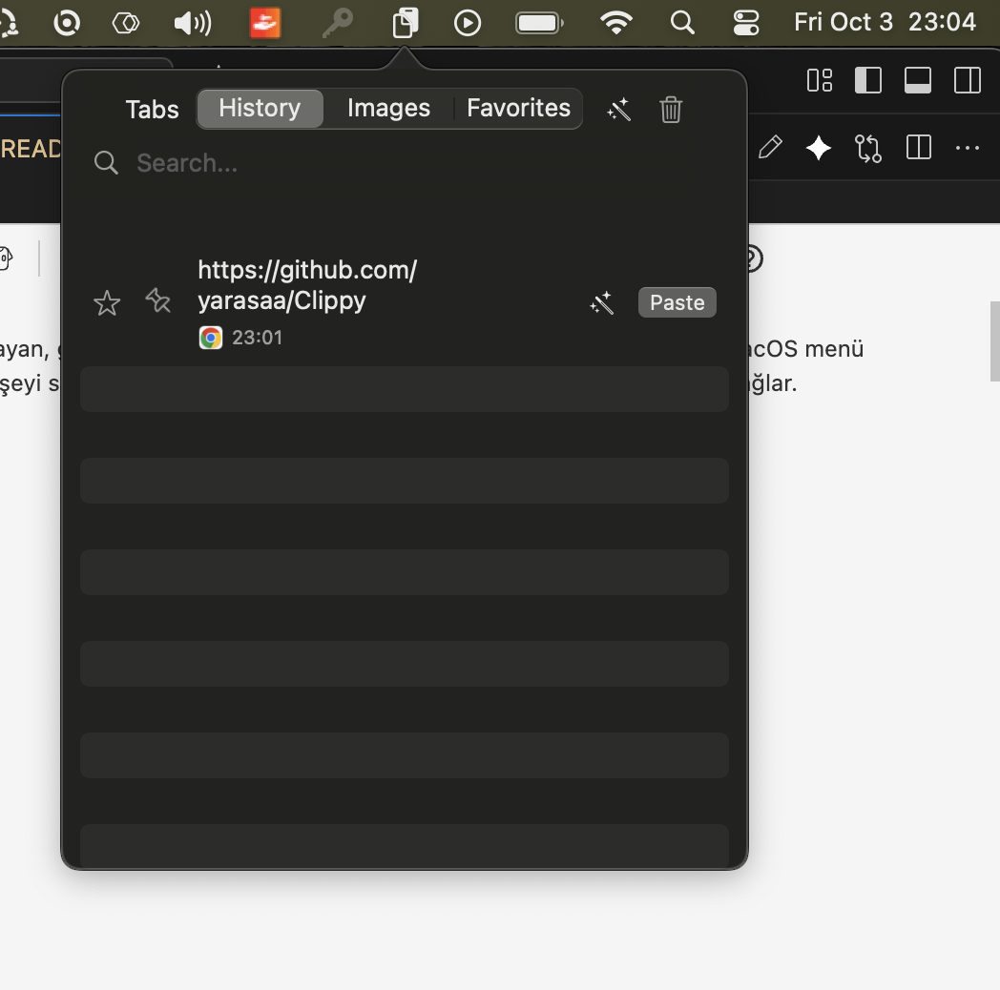
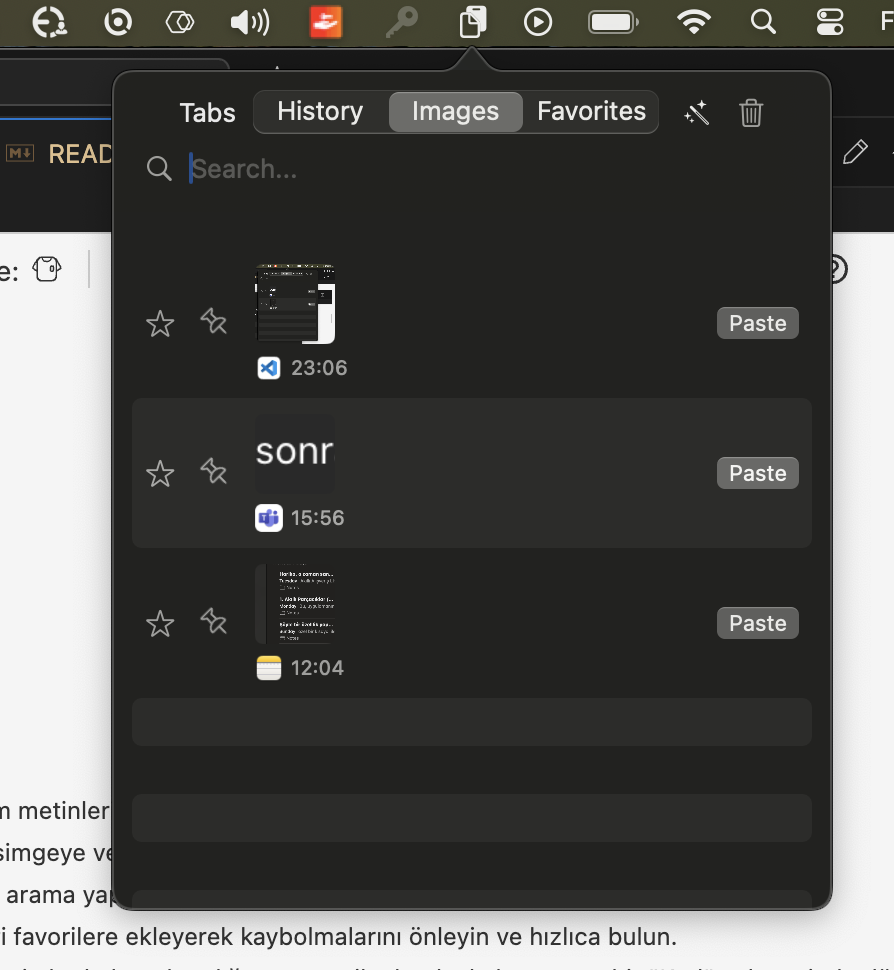
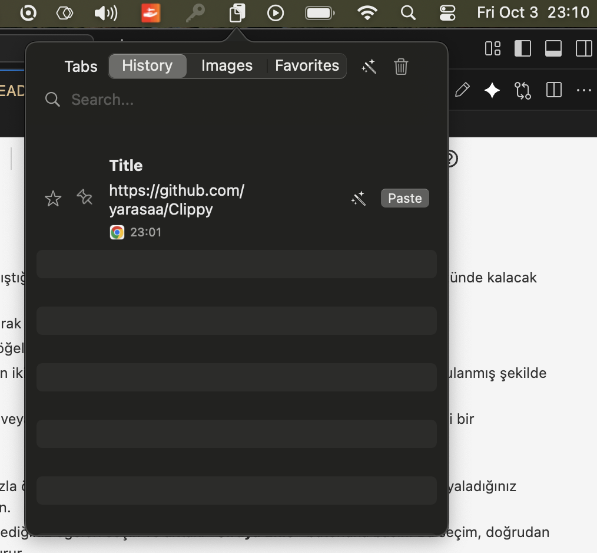
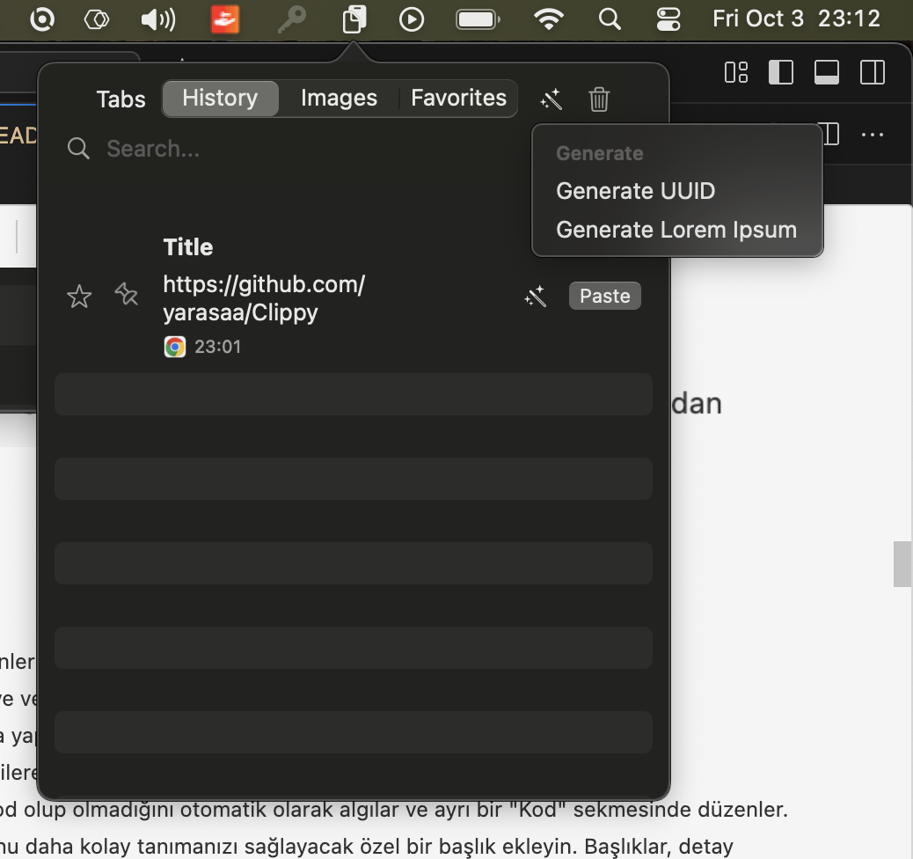
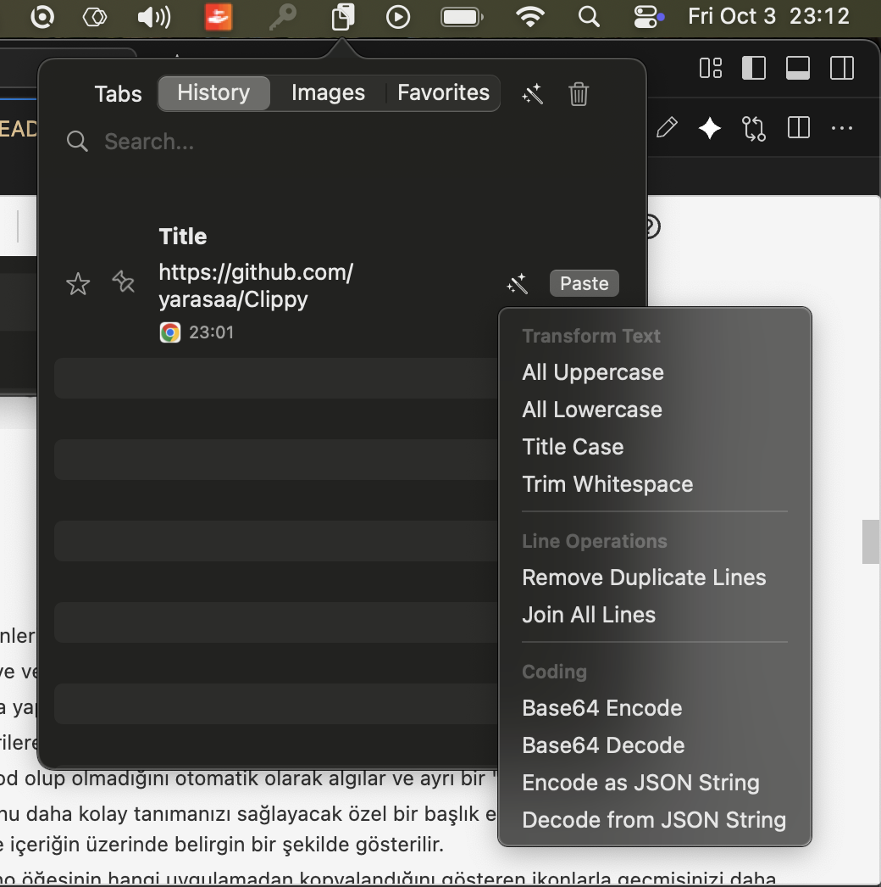
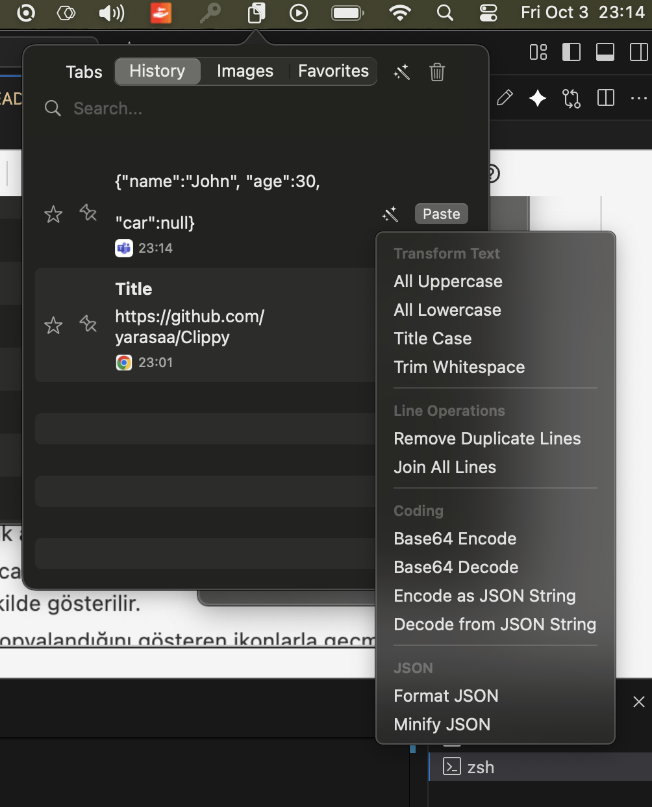
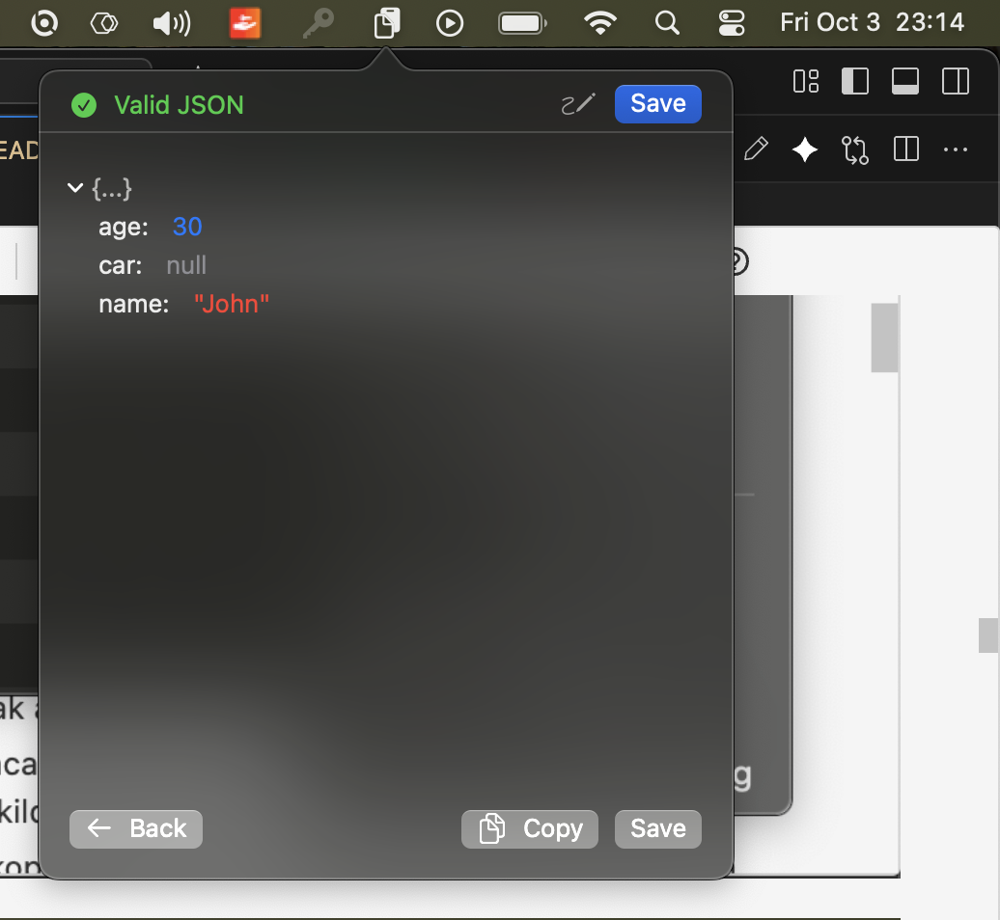
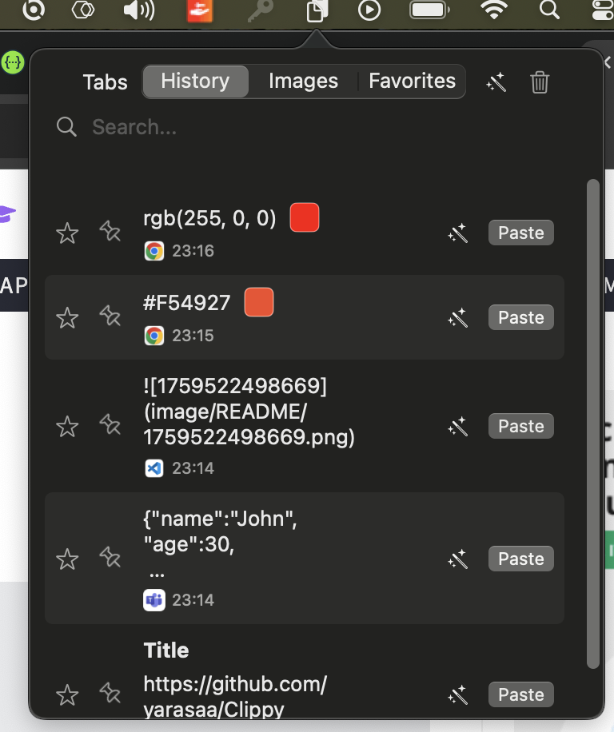

# Clippy for macOS

<p align="center">
  <a href="https://buymeacoffee.com/12hrsofficp" target="_blank"></a>
</p>

Clippy, pano geçmişinizi yönetmenizi sağlayan, geliştiriciler ve sık metin kullananlar için tasarlanmış güçlü bir macOS menü çubuğu uygulamasıdır. Kopyaladığınız her şeyi saklar, onlara hızlıca erişmenizi, düzenlemenizi ve kullanmanızı sağlar.


















✨ Özellikler

### 📋 Temel Pano Yönetimi

- **Geçmiş Kaydı:** Kopyaladığınız tüm metinleri ve resimleri otomatik olarak kaydeder.
- **Hızlı Erişim & Arayüz:** Menü çubuğundaki simgeye veya klavye kısayoluna basarak pano geçmişinize anında erişin.
- **Arama:** Tüm geçmişinizde anında arama yapın.
- **Favoriler:** Sık kullandığınız öğeleri favorilere ekleyerek kaybolmalarını önleyin ve hızlıca bulun.
- **Kod Algılama:** Kopyalanan metinlerin kod olup olmadığını otomatik olarak algılar ve ayrı bir "Kod" sekmesinde düzenler.
- **Özel Başlıklar:** Her bir pano öğesine, onu daha kolay tanımanızı sağlayacak özel bir başlık ekleyin. Başlıklar, detay ekranından düzenlenebilir ve ana listede içeriğin üzerinde belirgin bir şekilde gösterilir.
- **Kaynak Uygulama İkonları:** Her bir pano öğesinin hangi uygulamadan kopyalandığını gösteren ikonlarla geçmişinizi daha kolay takip edin.

### Gelişmiş İşlevsellik

- **Sabitleme (Pinning):** O an üzerinde çalıştığınız önemli öğeleri, yeni kopyalamalar yapılsa bile listenin en üstünde kalacak şekilde sabitleyin.
- **Çoklu Seçim:** `Cmd (⌘)` tuşuna basılı tutarak birden fazla öğeyi seçin.
- **Hepsini Yapıştır:** Seçtiğiniz tüm metin öğelerini, aralarına yeni satır ekleyerek tek seferde yapıştırın.
- **Diff (Fark) Görüntüleyici:** `Cmd` ile seçilen iki metin öğesi arasındaki farkları yan yana, karakter bazında vurgulanmış şekilde gösteren bir özellik.
- **Sürükle & Bırak:** Listeden tek bir öğeyi veya `Cmd` ile seçtiğiniz birden fazla metin öğesini sürükleyip herhangi bir uygulamaya bırakın.
- **Sıralı Yapıştırma:**
  - **Kısayolla:** `Cmd+Shift+C` ile birden fazla öğeyi sırayla kopyalayın. Ardından `Cmd+Shift+B` ile bu öğeleri kopyaladığınız sırayla farklı yerlere tek tek yapıştırın.
  - **Görsel Seçimle:** Listeden `Cmd` ile istediğiniz öğeleri seçin ve alttaki **"Sıraya Ekle"** butonuna basın. Menü çubuğu ikonu, kuyruk durumunu gösterecek şekilde güncellenir (örn: "1/5").
- **Resimleri Birleştirme:** Çoklu seçimle (`Cmd`) seçtiğiniz birden fazla resmi, sağ tık menüsünden tek bir resim olarak dikey veya yatay şekilde birleştirin.
- **Doğrudan Yapıştırma:** Her öğenin yanındaki "Yapıştır" butonu ile doğrudan aktif uygulamaya yapıştırın.
- **Hızlı Metin Önizleme:** Fareyi bir metin öğesinin üzerine getirerek, sistemin standart yardım balonuyla içeriğin tamamını görün.
- **Şifreleme (Encryption):** Hassas verilerinizi sağ tık menüsünden tek tıkla şifreleyin. Şifreli öğelerin içeriği, siz tekrar şifresini çözene kadar gizli kalır.
- **Akıllı Algılama:**
  - **Takvim Etkinliği:** "Yarın 14:00'te toplantı" gibi bir metin kopyalandığında, bunu algılayıp tek tıkla takvime etkinlik ekleme önerisi sunar.
  - **JSON Görüntüleyici:** Kopyalanan bir JSON metnini otomatik olarak algılar ve detay görünümünde hiyerarşik bir ağaç yapısında gösterir. Bu görünümde JSON'u düzenleyebilir, doğrulayabilir ve anahtar/değer/yol kopyalayabilirsiniz.
  - **Resimden Metin Çıkarma (OCR):** Bir resmin detay ekranında, resimdeki metinleri tanıyıp panoya kopyalanabilir yeni bir metin öğesi olarak ekleyin.
  - **URL Algılama:** Kopyalanan metin bir URL ise yanında tarayıcıda açma butonu gösterilir.
  - **Gelişmiş Renk Algılama ve Dönüştürme:** Kopyalanan metin bir renk kodu ise otomatik olarak algılanır ve yanında renk önizlemesi gösterilir. Desteklenen formatlar:
    - **HEX:** `#FF5733`, `#F57`, `#FF5733AA` (alpha destekli)
    - **RGB/RGBA:** `rgb(255, 87, 51)`, `rgba(255, 87, 51, 0.8)`
    - **HSL/HSLA:** `hsl(9, 100%, 60%)`, `hsla(9, 100%, 60%, 0.8)`
    - Renk önizlemesine tıklayarak otomatik olarak tüm formatlara dönüştürülmüş hali görüntülenir ve kopyalanabilir
- **Metin Dönüştürme:** Öğelerin üzerine gelip `✨` simgesine tıklayarak metinleri anında dönüştürün:
  - Tümü Büyük Harf
  - Tümü Küçük Harf
  - Başlık Stili (Her Kelimenin İlk Harfi Büyük)
  - Baştaki/Sondaki Boşlukları Temizle
  - Base64 Kodlama / Kod Çözme
  - Yinelenen Satırları Silme
  - Tüm Satırları Tek Satırda Birleştirme
  - **JSON String Encode/Decode:** Ham bir metni, bir JSON dosyasına yapıştırmak için geçerli bir string literaline (`"metin"`) dönüştürün veya bu işlemi geri alın.
- **Araçlar Menüsü:** Tek bir menüden test verileri (UUID, Lorem Ipsum) oluşturun veya aktif sekmedeki tüm öğeleri silin.
- **Detaylı Metin İstatistikleri:** Bir metin öğesinin detay ekranında karakter, kelime ve satır sayılarını anlık olarak görün.

### 🖼️ Window Switcher: Uygulama Pencereleriniz için Geçici bir Dock

macOS'in `⌘+Tab` kısayolu uygulamalar arasında geçiş yapmak için harika olsa da, _aynı uygulamanın_ birden çok penceresiyle (örneğin, birkaç Finder penceresi veya kod projesi) çalışırken yetersiz kalır. Bu özellik, aktif uygulamanızın pencereleri için geçici, anında açılan bir "dock" görevi görerek size kristal netliğinde bir genel bakış ve ışık hızında klavye navigasyonu sunar.

Bu yaklaşım, çok sevilen açık kaynaklı bir uygulama olan **DockDoor**'un zarif işlevselliğinden büyük ölçüde ilham almıştır.

- **Dock Benzeri Önizlemeler:** Tıpkı macOS Dock'undaki bir uygulamanın üzerine fareyle geldiğinizde pencerelerinin bir önizlemesini görmeniz gibi, bu özellik de `Option+Tab` tuşlarına bastığınızda size tüm pencerelerin canlı önizlemelerini sunarak anında tam bir genel bakış sağlar. Artık hangi pencerenin hangisi olduğunu tahmin etmenize gerek yok.
- **Basılı Tut-Bırak İş Akışı:** Panel, yalnızca `Option` tuşunu basılı tuttuğunuz sürece görünür kalır. Tuşu bıraktığınız an panel kaybolur ve seçtiğiniz pencereye geçiş yaparsınız. Bu, iş akışınızın önüne asla geçmeyen bir yöntemdir.
- **Akıcı Klavye Navigasyonu:** `Option` tuşunu basılı tutarken, pencereleriniz arasında geçiş yapmak için `Tab` tuşuna basmanız yeterlidir. Hızlı, verimli ve ellerinizi klavyeden ayırmanıza gerek bırakmaz.
- **Akıllı ve Hızlı:** Panel, anlık bir his vermesi için son derece optimize edilmiştir. Yanlışlıkla geçişi önlemek için paneli açan ilk `Tab` tuşunu akıllıca yok sayar ve her seferinde hızlı bir deneyim sağlamak için bileşenlerini yeniden kullanır.

- **Araçlar Menüsü:** Tek bir menüden test verileri (UUID, Lorem Ipsum) oluşturun veya aktif sekmedeki tüm öğeleri silin.
- **Detaylı Metin İstatistikleri:** Bir metin öğesinin detay ekranında karakter, kelime ve satır sayılarını anlık olarak görün.

### 📸 Gelişmiş Ekran Görüntüsü Düzenleyici

- **Kısayolla Yakalama:** Özelleştirilebilir bir klavye kısayolu ile ekranın istediğiniz bir alanının görüntüsünü alın.
- **Zengin Çizim Araçları:**

  - **Seç & Taşı:** Evrensel seçim aracı - herhangi bir çizimi seçerek taşıyın, düzenleyin veya silin
  - **Ok & Çizgi:** Özelleştirilebilir renk ve kalınlıkta oklar ve çizgiler çizin
  - **Şekiller (Dikdörtgen, Elips):** Dolgu, çizgi veya her ikisi modu ile şekiller ekleyin, köşe yuvarlatma ayarlanabilir
  - **Metin:** Özel arka plan renkleri ve içeriğe göre otomatik boyutlanan yazı tipleri ile zengin metin çizileri ekleyin
  - **Pin/Numara:** Özelleştirilebilir şekillerde (daire, kare, yuvarlatılmış kare) numaralı işaretçiler ekleyin
  - **Vurgulayıcı:** Yarı saydam vurgulama ile önemli alanları işaretleyin
  - **Spotlight:** Seçili alanlar (elips veya dikdörtgen) dışındaki her şeyi karartarak dikkat çekin
  - **Kalem:** Düz, kesikli veya marker stillerinde serbest çizim
  - **Emoji:** Boyutu ayarlanabilir emoji çizimleri ekleyin
  - **Bulanıklaştırma/Pikselleştirme:** Hassas bilgileri kolayca gizleyin
  - **Silgi:** Herhangi bir çizimi tek tıkla kaldırın

- **Evrensel Çizim Etkileşimi:**

  - **Tıkla & Sürükle:** Herhangi bir çizime tıklayarak seçin, ardından istediğiniz yere sürükleyin
  - **Çift Tıklama ile Düzenleme:** Metin çizilerine çift tıklayarak anında düzenleyin
  - **Boyutlandırma Tutamaçları:** Çoğu çizimde boyutlandırmak için köşe/kenar tutamaçları bulunur
  - **Sağ Panel Kontrolleri:** Her aracın seçildiğinde görünen kendi kontrol paneli vardır
  - **Otomatik Seçim Moduna Geçiş:** Şekiller oluşturduktan sonra, kolay düzenleme için otomatik olarak seçim moduna geçer

- **Görsel Efektler Paneli:**

  - **Arka Plan:** Ekran görüntünüze düz renk veya gradyan (degrade) arka planlar ekleyin
  - **İç Boşluk (Inset):** Görüntü ile arka plan arasında estetik bir boşluk bırakın
  - **Gölge & Köşe Yuvarlatma:** Görüntünüze ve arka planınıza derinlik ve modern bir görünüm katın

- **Akıcı Gezinme:**

  - `Cmd` + Fare tekerleği ile imlecinizin olduğu noktaya hassas bir şekilde yakınlaşın/uzaklaşın
  - Fare tekerleği ile görüntüde gezinin
  - Herhangi bir çizimin üzerine gelin ve taşıma imlecini görün

- **Akıllı Metin Oluşturma:**

  - Siz yazarken metin kutuları otomatik olarak büyür (yatay ve dikey)
  - Enter tuşu ile çok satırlı metin desteği
  - Yazı tipi boyutu ayarlamaları otomatik olarak metin kutusunu yeniden boyutlandırır
  - Daha iyi okunabilirlik için yuvarlatılmış köşeli arka plan renkler

### ⚙️ Özelleştirme ve Ayarlar

- **Arayüz Özelleştirme:** Ana pencerenin genişliğini ve yüksekliğini ayarlayın. Tüm uygulama genelinde kişiselleştirilmiş bir görünüm için tercih ettiğiniz temayı (Açık, Koyu veya Sistem Varsayılanı) seçin.
- **Özelleştirilebilir Kısayollar:** Hem uygulamayı açma hem de "Hepsini Yapıştır" işlevi için kendi klavye kısayollarınızı belirleyin.
- **Dil Desteği:** Uygulamayı Türkçe veya İngilizce olarak kullanın.
- **Sekme Yönetimi:** İhtiyaç duymadığınız "Kod", "Resimler", "Snippet'lar" veya "Favoriler" sekmelerini gizleyin.
- **Limit Ayarları:** Geçmişte ve favorilerde tutulacak maksimum öğe sayısını belirleyin.
- **Oturumda Başlatma:** Mac'iniz açıldığında Clippy'nin otomatik olarak başlamasını sağlayın.
- **Modern Ayarlar Penceresi:** Ayarlar, "Genel", "Kısayollar" ve "Gelişmiş" sekmeleri altında gruplanarak daha düzenli ve kullanıcı dostu bir hale getirildi.
- **Uyku Modu Desteği:** Bilgisayarınız uyku modundan çıktıktan sonra, Clippy'nin tüm özellikleri (pano izleme, kısayollar, anahtar kelime genişletme) otomatik olarak yeniden başlatılır ve sorunsuz bir şekilde çalışmaya devam eder.
- **Gelişmiş Pencere Yönetimi:** Ayarlar veya Hakkında penceresi arka planda açıkken, menü çubuğu ikonuna sağ tıklayarak aynı seçeneği tekrar seçerseniz, pencere otomatik olarak ön plana gelir. Bu özellik minimize edilmiş pencereler için de çalışır ve farklı çalışma alanları (workspace) arasında bile pencereleri doğru şekilde getirir.

### 🛠️ Akıllı Araçlar & Geliştirici Özellikleri

- **Diff (Fark) Görüntüleyici:** `Cmd` ile seçilen iki metin öğesi arasındaki farkları yan yana, karakter bazında vurgulanmış şekilde gösteren bir özellik.
- **JSON Görüntüleyici:** Kopyalanan bir JSON metnini otomatik olarak algılar ve detay görünümünde hiyerarşik bir ağaç yapısında gösterir. Bu görünümde JSON'u düzenleyebilir, doğrulayabilir ve anahtar/değer/yol kopyalayabilirsiniz.
- **Takvim Etkinliği Algılama:** "Yarın 14:00'te toplantı" gibi bir metin kopyalandığında, bunu algılayıp tek tıkla takvime etkinlik ekleme önerisi sunar.
- **Şifreleme (Encryption):** Hassas verilerinizi sağ tık menüsünden tek tıkla şifreleyin. Şifreli öğelerin içeriği, siz tekrar şifresini çözene kadar gizli kalır.
- **Araçlar Menüsü:** Tek bir menüden test verileri (UUID, Lorem Ipsum) oluşturun veya aktif sekmedeki tüm öğeleri silin.
- **Detaylı Metin İstatistikleri:** Bir metin öğesinin detay ekranında karakter, kelime ve satır sayılarını anlık olarak görün.

### ⚡️ Performans & Optimizasyon

- **Verimli Yükleme:** Core Data toplu getirme (batch fetching) ve küçük resim önbellekleme (thumbnail caching) sayesinde, uygulama artık uzun öğe listelerini, özellikle de resimleri, çok daha hızlı ve önemli ölçüde daha az bellek kullanarak yükler ve kaydırır.

### ⌨️ Anahtar Kelime ile Yapıştırma (Snippet Genişletme)

Bu özellik, sık kullandığınız metin parçacıklarını (snippet) bir anahtar kelime ile anında yapıştırmanızı sağlar. Snippet'lar, kendilerine özel **"Snippet'lar"** sekmesinde düzenlenerek kolay erişim ve yönetim sağlar.

#### 📁 Kategori Sistemi

Snippet'larınızı kategorilere ayırarak daha organize ve kolay erişilebilir hale getirin!

**Özellikler:**

- **Özelleştirilebilir Kategoriler:** Kendi kategorilerinizi oluşturun ve emoji ikonları ile kişiselleştirin
- **Yatay Kaydırılabilir Filtre:** Snippet'lar sekmesinde arama kutusunun altında, kategorileri filtrelemek için yatay bir kaydırma menüsü bulunur
- **Gezinme Okları:** Sol ve sağ ok butonları ile kategoriler arasında kolayca gezinin (pencere genişliği sabit kalır)
- **Kategori Atama:** Snippet detay ekranından her snippet'e kategori atayabilir veya değiştirebilirsiniz
- **Sistem Genelinde Açma/Kapama:** Kategori sistemini tamamen kapatabilirsiniz (kapatıldığında tüm snippet'lar filtresiz gösterilir)

**Kullanım:**

1. **Ayarlar > Snippet'lar** bölümünden "Snippet Kategorileri" sekmesine gidin
2. Kategori sistemini etkinleştirin (varsayılan: etkin)
3. Yeni kategori eklemek için:
   - Kategori adını girin (örn: "E-posta Şablonları")
   - Emoji ikonuna tıklayarak istediğiniz emojiye seçin (varsayılan: 📁)
   - "Ekle" butonuna tıklayın
4. Bir snippet'e kategori atamak için:
   - Snippet'ın detay ekranını açın
   - "Kategori" açılır menüsünden istediğiniz kategoriyi seçin
   - "Kaydet" butonuna tıklayın
5. Snippet'ları kategoriye göre filtrelemek için:
   - Snippet'lar sekmesine gidin
   - Arama kutusunun altındaki kategori butonlarından birini seçin
   - Sol/sağ ok butonları ile daha fazla kategori görün

**Varsayılan Kategoriler:**

Uygulama ilk kurulduğunda şu kategorilerle gelir (tümü silinebilir ve düzenlenebilir):

- 📧 E-posta
- 💼 İş
- 📝 Kişisel
- 💻 Kod
- 📋 Şablonlar

**Örnek Kullanım Senaryosu:**

```
Kategori: 💻 Kod
Anahtar Kelime: ;func
İçerik:
function {isim}({parametreler}) {
  {kod}
}

Kategori: 📧 E-posta
Anahtar Kelime: ;tesekkur
İçerik:
Merhaba {isim},

Yardımınız için çok teşekkür ederim!

Saygılarımla,
{{;imza}}
```

#### Temel Kullanım

- **Anahtar Kelime:** `;imza`
- **İçerik:**
  ```
  Saygılarımla,
  Mehmet Akbaba
  ```
- **Sonuç:** Herhangi bir yerde `;imza` yazdığınızda, bu metin otomatik olarak yapıştırılır.

#### Backspace & Escape Desteği

- **Backspace (⌫):** Anahtar kelimeyi yazarken hata yaptıysanız, backspace tuşuna basarak son karakteri silebilirsiniz.
- **Escape (ESC):** Snippet yazmaktan vazgeçtiyseniz, ESC tuşuna basarak bufferi sıfırlayabilirsiniz.

#### Dinamik İçerik: Anlık Verilerle Snippet'lar

Snippet'larınızın içine "sihirli kelimeler" ekleyerek, her seferinde güncel bilgilerin otomatik olarak doldurulmasını sağlayın.

##### Temel Placeholderlar

| Sihirli Kelime  | Açıklama                       | Örnek Sonuç                  |
| --------------- | ------------------------------ | ---------------------------- |
| `{{DATE}}`      | Geçerli tarihi ekler.          | `2025-10-05`                 |
| `{{TIME}}`      | Geçerli saati ekler.           | `15:30:25`                   |
| `{{DATETIME}}`  | Tarih ve saati birlikte ekler. | `2025-10-05 15:30`           |
| `{{UUID}}`      | Benzersiz bir ID oluşturur.    | `A9A4E42D-3C6F-4E8B-9F3C...` |
| `{{CLIPBOARD}}` | Panodaki mevcut metni ekler.   | _(Panonuzdaki son metin)_    |

**Örnek:**

- **Anahtar Kelime:** `;rapor`
- **İçerik:** `Rapor Tarihi: {{DATE}} - {{TIME}}`
- **Sonuç:** `Rapor Tarihi: 2025-10-05 - 15:30:25`

##### Gelişmiş Placeholderlar

**1. Rastgele Sayı Üretme**

- **Kullanım:** `{{RANDOM:min-max}}`
- **Örnek:**
  ```
  Sipariş No: {{RANDOM:1000-9999}}
  ```
- **Sonuç:** `Sipariş No: 3847` (her seferinde farklı)

**2. Dosya İçeriği Ekleme**

- **Kullanım:** `{{FILE:/dosya/yolu}}`
- **Örnek:**
  ```
  İmza:
  {{FILE:~/Documents/imza.txt}}
  ```
- **Sonuç:** Belirtilen dosyanın içeriğini snippet'e ekler.

**3. Shell Komutu Çıktısı**

- **Kullanım:** `{{SHELL:komut}}`
- **Örnek:**
  ```
  Bilgisayar Adı: {{SHELL:hostname}}
  IP Adresi: {{SHELL:ipconfig getifaddr en0}}
  Mevcut Kullanıcı: {{SHELL:whoami}}
  ```
- **Sonuç:** Shell komutunun çıktısını snippet'e ekler.

**4. Özel Snippet Değişkenleri**

- **Kullanım:** `{{DEGISKEN_ADI}}`
- **Nasıl Oluşturulur:** **Ayarlar > Snippet'lar > Snippet Variables** bölümünden global değişkenler tanımlayın
- **Örnek:**

  Önce değişkeni tanımlayın:

  ```
  Değişken Adı: COMPANY_NAME
  Değer: Acme Corporation
  ```

  Sonra herhangi bir snippet'te kullanın:

  ```
  E-posta İmzası:
  {{MY_NAME}}
  {{JOB_TITLE}}
  {{COMPANY_NAME}}
  ```

- **Özellikler:**
  - Değişken değerlerinde dynamic placeholder'lar kullanabilirsiniz (`{{DATE}}`, `{{UUID}}`, vb.)
  - Tüm snippet'larda kullanılabilir
  - Merkezi bir yerden güncellenebilir
  - Örnek: `MY_NAME` değişkenine `{{CLIPBOARD}}` atayarak, her kullanımda panodaki güncel değeri alabilirsiniz

**5. İç İçe Snippet'lar**

- **Kullanım:** `{{;snippet_adi}}`
- **Örnek:**

  Önce bir `;name` snippet'i oluşturun:

  ```
  Mehmet Akbaba
  ```

  Sonra başka bir snippet'te kullanın:

  ```
  Toplantı Notu
  Katılımcı: {{;name}}
  Tarih: {{DATE}}
  ```

- **Sonuç:** İç içe snippet'lar otomatik olarak genişletilir (maksimum 5 seviye derinlik).

**Gelişmiş Kombine Örnek:**

```
📅 Toplantı Notu

Tarih: {{DATETIME}}
Katılımcı: {isim}
Toplantı ID: {{RANDOM:1000-9999}}

Notlar:
{notlar}

---
İmza: {{;imza}}
Sistem: {{SHELL:sw_vers -productVersion}}
```

#### Parametreli Genişletme: İnteraktif Snippet'lar

Snippet'larınıza `{parametre}` formatında değişkenler ekleyerek interaktif şablonlar oluşturun. Anahtar kelimeyi yazdığınızda, Clippy size bu değişkenleri doldurmanız için akıllı bir pencere açar.

**Örnek:**

- **Anahtar Kelime:** `;email`
- **İçerik:** `Merhaba {isim}, nasılsın?`
- **Nasıl Çalışır:** `;email` yazdığınızda, "isim" parametresini girebileceğiniz bir pencere açılır. "Mehmet" yazıp onaylarsanız, `Merhaba Mehmet, nasılsın?` metni yapıştırılır.

##### Canlı Önizleme

Parametreleri doldururken, snippet'inizin son halini **canlı önizleme** bölümünde görebilirsiniz:

- Parametreleri yazdıkça önizleme otomatik olarak güncellenir
- Dynamic placeholder'lar ({{DATE}}, {{TIME}}, vb.) gerçek değerleriyle gösterilir
- Boş parametreler `[parametre_adi]` şeklinde gösterilir
- Önizleme bölümü tıklanarak açılıp kapatılabilir (varsayılan: açık)

##### Akıllı Girdi Tipleri ve Varsayılan Değerler

Parametrelerinize tipler ve varsayılan değerler atayarak veri girişini daha da hızlandırın.

- **Tarih Seçici:** `{teslim_tarihi:date}`
- **Açılır Menü:** `{oncelik:choice:Düşük,Orta,Yüksek}`
- **Varsayılan Değerli Açılır Menü:** `{durum:choice:Aktif,Pasif=Aktif}`

**Gelişmiş Bir Örnek:**

- **Anahtar Kelime:** `;hata`
- **İçerik:**
  ```
  Hata Raporu
  - Açıklama: {aciklama}
  - Kritiklik: {kritiklik:choice:Düşük,Orta,Yüksek=Orta}
  - Çözüm Tarihi (Tahmini): {cozum_tarihi:date}
  ```
- **Nasıl Çalışır:** `;hata` yazdığınızda, `aciklama` için boş bir metin kutusu, `kritiklik` için "Orta" seçeneği seçili bir açılır menü ve `cozum_tarihi` için bir takvim gösteren bir pencere açılır.

#### Bağlamsal Genişletme: Uygulamaya Özel Snippet'lar

Snippet'larınızın sadece belirli uygulamalarda çalışmasını sağlayarak farklı iş akışları için özel araçlar oluşturun.

- **Kod Editörüne Özel Snippet:**
  - **Anahtar Kelime:** `;log`
  - **İçerik:** `console.log('{degisken}', {degisken});`
  - **Uygulama Kuralı:** Snippet'ın detay ekranındaki "Uygulama Kuralları" alanına `com.microsoft.VSCode` yazın.
  - **Sonuç:** Artık `;log` anahtar kelimesi sadece VS Code'da çalışacaktır.

#### Snippet İstatistikleri

Her snippet için kullanım istatistiklerini detay sayfasında görebilirsiniz:

- **Kullanım Sayısı:** Snippet'in kaç kez kullanıldığını gösterir (mavi grafik ikonu ile)
- **Son Kullanım:** En son ne zaman kullanıldığını gösterir (yeşil saat ikonu ile, göreceli zaman formatında: "5 dakika önce", "2 saat önce", vb.)

Bu istatistikler, hangi snippet'ları sıklıkla kullandığınızı görmenizi ve snippet koleksiyonunuzu optimize etmenizi sağlar.

#### Import & Export

Snippet'larınızı yedekleyebilir veya farklı cihazlar arasında paylaşabilirsiniz:

- **Export (Dışa Aktarma):**

  - Snippet'lar sekmesindeyken, herhangi bir snippet'e **sağ tıklayın**
  - **"Seçili Snippet'i Dışa Aktar"** - Sadece o snippet'i dışa aktarır
  - **"Tüm Snippet'ları Dışa Aktar"** - Tüm snippet'larınızı tek bir JSON dosyasına kaydeder
  - Dosya adı, tek snippet için `{keyword}_snippet.json`, tüm snippet'lar için `snippets_export.json` olarak otomatik oluşturulur

- **Import (İçe Aktarma):**
  - Snippet'lar sekmesinin **sağ üst köşesindeki** aşağı ok (↓) butonuna tıklayın
  - JSON dosyasını seçin
  - Aynı anahtar kelimeye sahip snippet'lar atlanır, yeni olanlar eklenir
  - İşlem sonunda kaç snippet'in başarıyla aktarıldığı gösterilir

**JSON Format Örneği:**

```json
[
  {
    "keyword": ";imza",
    "content": "Saygılarımla,\nMehmet Akbaba",
    "category": "Genel",
    "applicationRules": ""
  },
  {
    "keyword": ";log",
    "content": "console.log('{degisken}', {degisken});",
    "category": "Kod",
    "applicationRules": "com.microsoft.VSCode"
  }
]
```

#### Nasıl Çalışır?

- **Kolay Kullanım:** Herhangi bir metin öğesinin detay ekranına gidin ve bir anahtar kelime (örn: `;imza`) atayın. Öğe, otomatik olarak "Snippet'lar" sekmesine taşınacaktır.
- **Sistem Genelinde Çalışma:** Atadığınız anahtar kelimeyi herhangi bir metin alanında yazdığınızda, Clippy içeriği sizin için yapıştırır.
- **Performans Odaklı:** Tüm anahtar kelimeler, anlık performans için bellekte önbelleğe alınır.
- **Kontrol Sizde:** Bu özelliği Ayarlar menüsünden tamamen kapatabilir veya menü çubuğu ikonuna sağ tıklayarak geçici olarak duraklatıp yeniden başlatabilirsiniz.

## 🚀 Kullanım

1. **Uygulamayı Açma:**

   - Menü çubuğundaki Clippy simgesine tıklayın.
   - Veya varsayılan kısayol olan `Cmd (⌘) + Shift (⇧) + V` tuşlarına basın.

2. **Öğe Yapıştırma:**

   - **Tek Öğe:** Öğenin üzerine gelin ve "Yapıştır" butonuna tıklayın.
   - **Çoklu Öğe:** `Cmd (⌘)` tuşuna basılı tutarak istediğiniz öğeleri seçin. Pencerenin alt kısmında beliren **"Hepsini Yapıştır"** butonuna tıklayın veya kısayolunu (`Cmd (⌘) + Shift (⇧) + P`) kullanın.

3. **Diğer Eylemler (Sağ Tık Menüsü):**

   - Bir öğenin üzerine sağ tıklayarak **Kopyala, Şifrele/Çöz, Farkları Karşılaştır, Sil** gibi tüm gelişmiş eylemlere erişin.

4. **Favorilere Ekleme ve Sabitleme:**

   - Her öğenin solundaki yıldız (`☆`) simgesine tıklayarak favorilerinize ekleyin veya çıkarın.
   - Yıldızın yanındaki pin (`📌`) simgesine tıklayarak önemli öğeleri listenin en üstüne sabitleyin.

5. **Ayarlar:**

   - Menü çubuğundaki Clippy simgesine **sağ tıklayın** ve "Ayarlar..." seçeneğini seçin.
   - Veya standart macOS kısayolu olan `Cmd (⌘) + ,` tuşlarını kullanın.

## ⌨️ Varsayılan Kısayollar

| Eylem                   | Kısayol                       |
| ----------------------- | ----------------------------- |
| Uygulamayı Göster/Gizle | `Cmd (⌘)` + `Shift (⇧)` + `V` |
| Seçilenleri Yapıştır    | `Cmd (⌘)` + `Shift (⇧)` + `P` |
| Sıraya Ekle             | `Cmd (⌘)` + `Shift (⇧)` + `C` |
| Sıradakini Yapıştır     | `Cmd (⌘)` + `Shift (⇧)` + `B` |
| Sıralı Kuyruğu Temizle  | `Cmd (⌘)` + `Shift (⇧)` + `K` |
| Ekran Görüntüsü Al      | `Cmd (⌘)` + `Shift (⇧)` + `1` |
| Çoklu Öğe Seçimi        | `Cmd (⌘)` + Tıklama           |
| Ayarları Aç             | `Cmd (⌘)` + `,`               |

> **Not:** Tüm klavye kısayolları, Ayarlar menüsünden tamamen özelleştirilebilir.

## 🛠️ Kurulum ve Güvenlik

### Kurulum

En son `.dmg` dosyasını Releases sayfasından indirin. DMG dosyasını açın ve **Clippy** uygulamasını **Uygulamalar (Applications)** klasörünüze sürükleyin.

### Güvenlik İzinleri

Clippy'nin diğer uygulamalara metin yapıştırabilmesi için **Erişilebilirlik** iznine ihtiyacı vardır.

Uygulama, bu izne ihtiyaç duyduğunda size otomatik olarak bir sistem penceresi gösterecektir. Bu penceredeki **"Sistem Ayarlarını Aç"** butonuna tıklayarak doğrudan ilgili ayar menüsüne gidebilir ve Clippy için izni etkinleştirebilirsiniz.

> **Gizlilik:** Clippy, pano verilerinizi asla internete göndermez. Tüm verileriniz, bilgisayarınızdaki `~/Library/Application Support/Clippy/` klasöründe, **Core Data** veritabanı (`Clippy.sqlite`) içinde güvenli bir şekilde saklanır.

## 💖 Destek Olun & Katkıda Bulunun

Clippy'yi severek kullanıyor musunuz? Projenin gelişimine destek olmak için birkaç yol var:

- **⭐ Yıldız Verin:** Projeyi GitHub'da yıldızlayarak daha fazla kişiye ulaşmasına yardımcı olabilirsiniz.
- **🐞 Hata Bildirin:** Bir hatayla karşılaşırsanız veya bir özelliğin daha iyi çalışabileceğini düşünüyorsanız, lütfen bir Issue açın.
- **💡 Fikirlerinizi Paylaşın:** Yeni özellik önerilerinizi ve fikirlerinizi duymaktan mutluluk duyarım!
- **☕ Kahve Ismarlayın:** Eğer uygulama işinize yarıyorsa ve gelişimini desteklemek isterseniz, bana bir kahve ısmarlayabilirsiniz.

Her türlü destek, projenin daha iyi bir hale gelmesi için büyük bir motivasyon kaynağıdır!

---

_Bu proje, verimliliği artırmak ve pano yönetimini kolaylaştırmak amacıyla geliştirilmiştir._
