# Clippy

> macOS için sıcak ve güçlü bir pano yöneticisi. Kart tabanlı geçmiş,
> akıllı içerik algılama, yerleşik ekran görüntüsü editörü, dock önizleme,
> yerel veya bulut AI destekli metin dönüşümleri — hepsi tamamen local,
> open source ve ücretsiz.

<p align="center">
  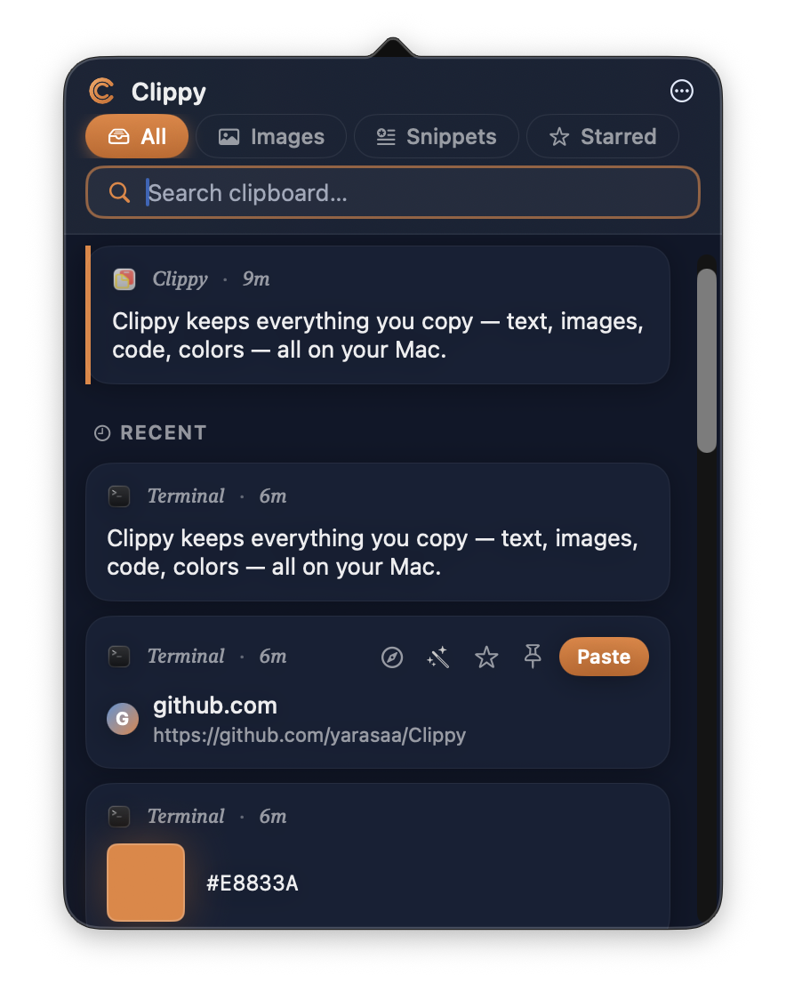
</p>

<p align="center">
  <a href="https://github.com/yarasaa/Clippy/releases/latest">
    
  </a>
  <a href="https://github.com/yarasaa/Clippy/blob/main/LICENSE">
    
  </a>
  
  <a href="https://buymeacoffee.com/12hrsofficp">
    
  </a>
</p>

**🌐** [English](README.md) · [Türkçe](README.tr.md) · [日本語](README.ja.md) · [简体中文](README.zh.md)

> **1.0.14 ile gelenler** — panona düz cümleyle soru sor, ekranın herhangi
> bir bölgesinden metin yakala, yeniden kullanılabilir şablonlar ve gerçek
> bir klavye akışı. [Neler değişti →](https://github.com/yarasaa/Clippy/releases/latest)

**İçindekiler** — [Neden Clippy?](#neden-clippy) · [Özellikler](#-özellikler-bir-bakışta) · [Öne çıkanlar](#öne-çıkanlar) · [Ayarlar](#ayarlar) · [Kurulum](#kurulum) · [Kısayollar](#klavye-kısayolları) · [Gizlilik](#gizlilik)

---

## Neden Clippy?

Kopyaladığın her şey — metin, görsel, kod, renk, URL — panoda kısa bir
süre durur ve kaybolur. Clippy hepsini saklar: menü çubuğunda arayabildiğin,
yıldızlayabildiğin, pinleyebildiğin ve kısayolla yapıştırabildiğin güzel bir
geçmişte.

Sonra daha da ileri gider: ona düz cümleyle soru sorabilir, herhangi bir
ekran görüntüsünden ya da ekranının bir bölgesinden metni çekip alabilir,
görsellere açıklama ekleyebilir, dosya dönüştürebilir ve metni yerel veya
bulut AI ile işleyebilirsin.

Hepsi **senin Mac'inde**. Hesap yok. Bulut yok. Telemetri yok.

## ✨ Özellikler bir bakışta

| | |
|---|---|
| 📋 **Akıllı pano geçmişi** — metin, URL, renk, JSON, kod ve görseller için içeriğe duyarlı önizlemeler |  |
| 💬 **Panona soru sor** — "o telefon numarası neydi?" Düz cümleyle sor, cevabı kaynaklarıyla al | 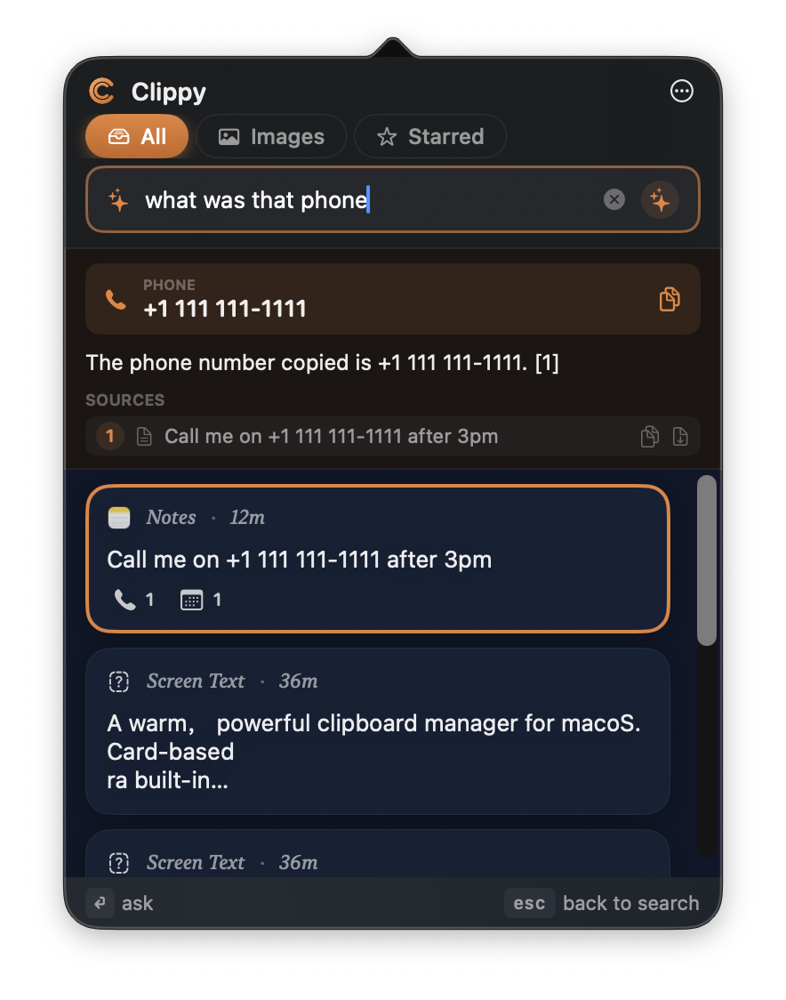 |
| 🔍 **Aranabilir ekran görüntüleri** — otomatik OCR her görseli cihazda okur, sadece bir resimde *gördüğün* metni bile arayabilirsin | 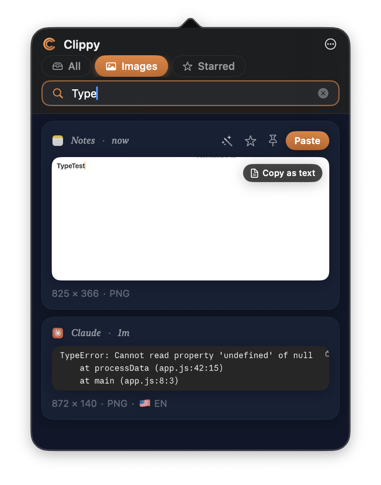 |
| 🎯 **Akıllı algılama** — telefon, e-posta, tarih, adres ve hassas veriler (kart, IBAN, API key) tek dokunuşluk eyleme dönüşür | 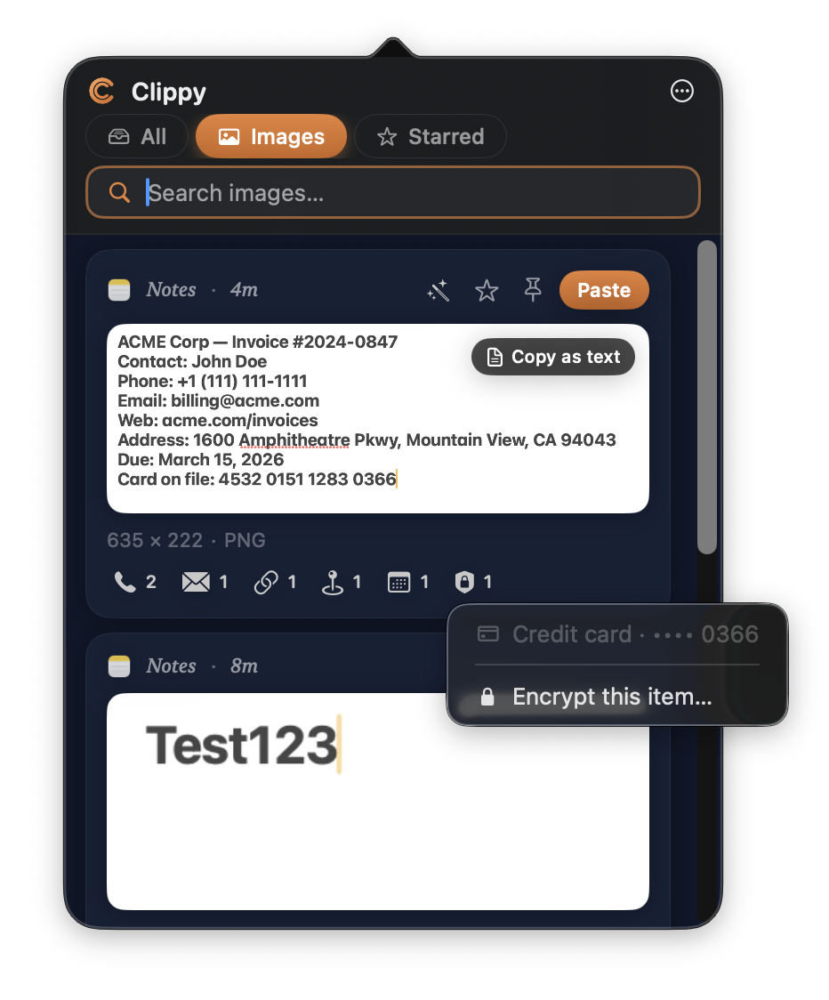 |
| ✍️ **Ekran görüntüsü editörü** — Studio Bar, bağlama duyarlı Inspector, 20+ açıklama aracı | 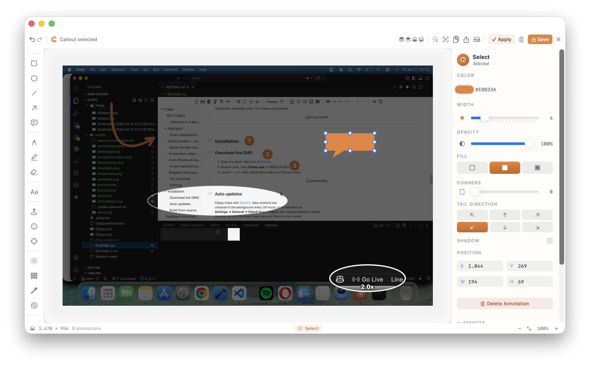 |
| ⚡ **Quick Preview** — kısayola bas, yüzen katmandan son öğelerini yapıştır | 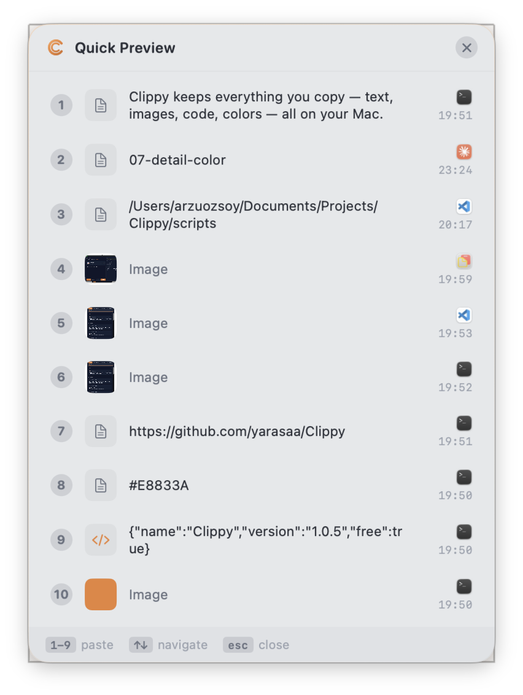 |
| ✨ **AI dönüşümleri** — özetle, çevir, dilbilgisini düzelt, kodu açıkla. Ollama ile yerel veya bulut | 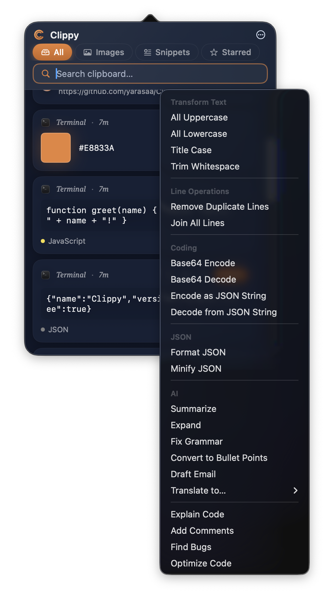 |
| 🪟 **Dock Preview** — Windows 11 tarzı küçük resimler, canlı akış ve numaralı rozetler | 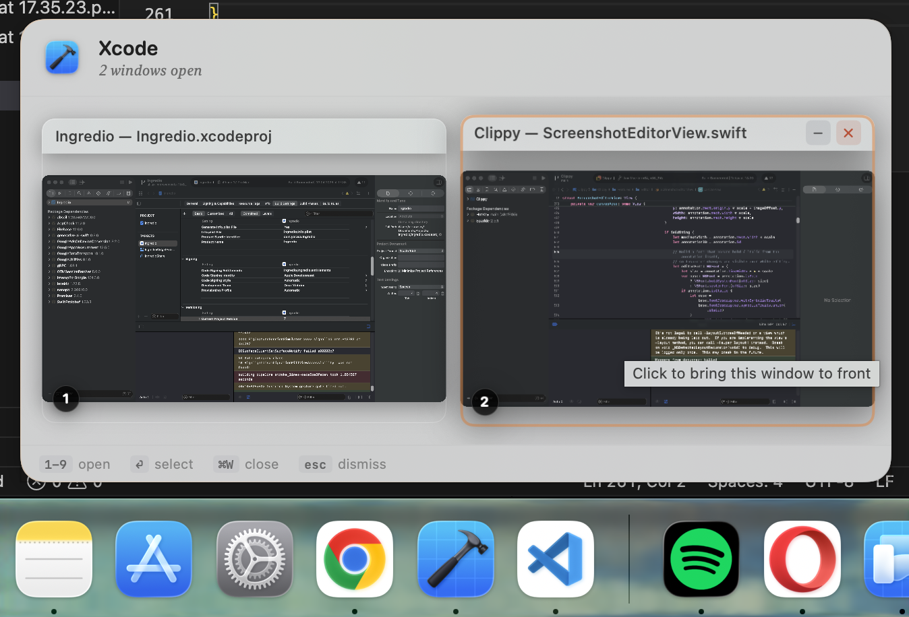 |
| 🧩 **Kendi kendine yazan snippet'ler** — yeniden kullanılabilir metni bir anahtar kelimeyle kaydet, her yerde çağır | 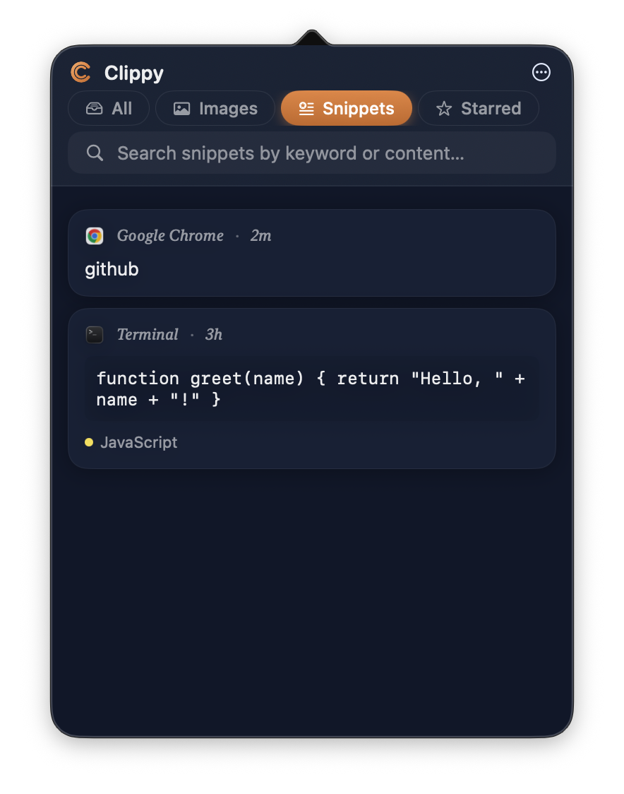 |

### Ayrıca içinde

- 🔎 **Ekrandan metin yakala** — ⇧⌘2'ye bas, ekranın herhangi bir bölgesinin üzerine sürükle, içindeki metin panoya düşsün
- 📐 **Şablonlar** — Clippy tekrar tekrar kopyaladığın metni fark eder ve yeniden kullanılabilir bir şablona dönüştürmeyi önerir
- 📱 **Telefona gönder** — her link okutabileceğin bir QR koduna dönüşür
- 🏷 **Otomatik başlıklar** — her öğe kısa ve okunabilir bir isim alır
- 🔤 **Live Text** — metni doğrudan ekran görüntüsünün üzerinde seç, tıpkı Fotoğraflar gibi
- 🌍 **Dil rozetleri** — ekran görüntüleri tespit edilen diliyle etiketlenir
- 🎯 **Hover eylemleri** — Yapıştır, Yıldızla, Pinle ve AI dönüşümü tam ihtiyacın olduğu anda belirir
- 🗂 **Dosya dönüştürücü** — görsel, doküman, ses, video, veri formatları
- 📦 **Shelf** — uygulamalar arasında elinin altında tutman gereken dosyalar için bir çekmece
- 🔐 **Şifreli öğeler** & içerik türü filtreleri — hassas kayıtları kilitle, türe göre süz

---

## Öne çıkanlar

### Akıllı pano geçmişi

Kopyalanan her şey, türüne göre akıllıca render ediliyor:

- **Metin** — kaynak uygulama, zaman ve ilk birkaç satır
- **URL** — host rozeti + tam URL önizleme
- **Renkler** — canlı swatch + HEX
- **Kod** — dil rozeti ve mono font
- **JSON** — yapıyı tek satıra toplar
- **Görseller** — boyut bilgisiyle tam kaplayan thumbnail

<p align="center">
  
</p>

Bir kartın üzerine gelince transform, yıldız, pin ve paste eylemleri belirir.

<p align="center">
  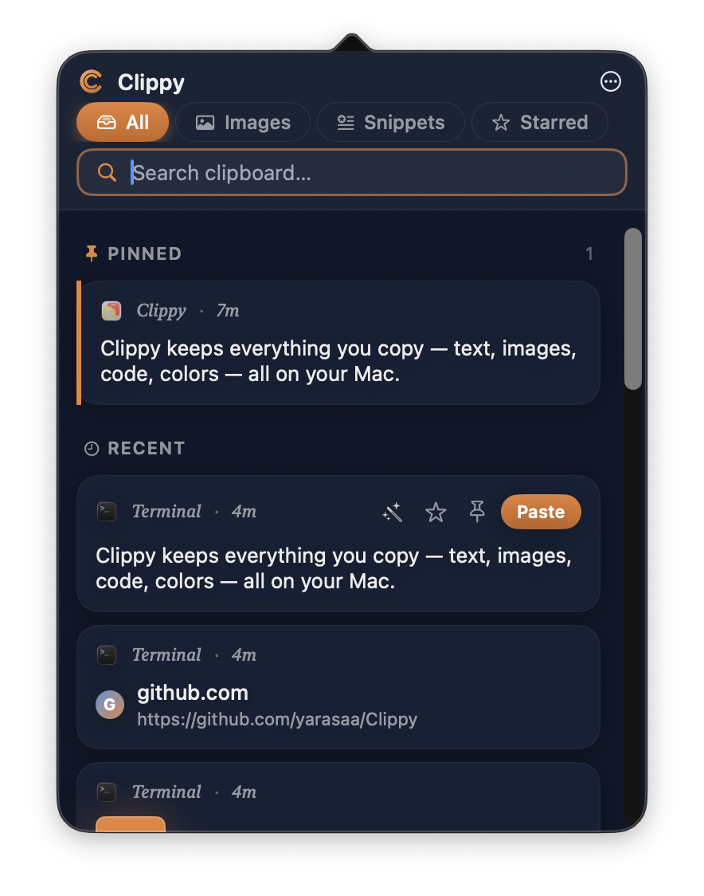
</p>

### 💬 Panona soru sor

Kopyaladığın o şeyi bulmak için listede gezinmeyi bırak, sor:

> *"o telefon numarası neydi"* · *"dün kopyaladığım link"* · *"pinlediklerim"*

Clippy neyi sorduğunu çözer — hangi zaman aralığı, hangi tür içerik, hangi
uygulamadan geldiği — geçmişini kelime eşleşmesine değil **anlama** göre
sıralar ve cevabı kullandığı öğelerle birlikte gösterir.

Somut değerler modele yeniden yazdırılmaz, orijinal metinden **birebir**
çıkarılır; yani telefon numarası her zaman gerçekten kopyaladığın numaradır.

Ollama ile yerel modellerde de, bulut sağlayıcılarla da çalışır; hiçbir
model tanımlı değilse cihaz üstü eşleştirmeye düşer.

<p align="center">
  
</p>

### 🔍 Aranabilir ekran görüntüleri (Otomatik OCR)

Herhangi bir görseli kopyala, Clippy içindeki metni arka planda okusun — cihazda, gizli ve ücretsiz. Sadece bir ekran görüntüsünde *gördüğün* bir kelimeyi ara, anında karşına gelsin. Apple Vision ile çalışır, **30+ dili** otomatik tanır, hiçbir ayar gerektirmez.

<p align="center">
  
</p>

### 🔎 Ekrandan metin yakala

**⇧⌘2**'ye bas, ekranın herhangi bir bölgesinin üzerine sürükle; içindeki
metin doğrudan panona gelsin. Videodaki yazı, seçim yaptırmayan bir PDF,
birinin gönderdiği ekran görüntüsü — görebiliyorsan kopyalayabilirsin.
Seçimde QR kod varsa o da çözülür.

Şunlar için birebir:

- bir videodaki ya da birinin sunduğu slayttaki yazı
- seçim yaptırmayan bir PDF
- sohbette sana gönderilen bir ekran görüntüsü
- yoksa elle yeniden yazacağın bir hata penceresi

### 🎯 Akıllı içerik algılama

Clippy panondaki eyleme geçirilebilir içeriği — hem **metinde hem ekran görüntülerinde** — yakalar ve tek dokunuşluk eyleme çevirir:

- **📞 Telefon / ✉️ E-posta / 🔗 URL** — dokun, ara, mail at veya aç
- **📅 Tarihler** — doğrudan Takvim'e ekle
- **📍 Adresler** — Harita'da aç
- **🔒 Hassas veriler** — kredi kartı, IBAN, API key ve TC kimlik algılanır (checksum doğrulamalı) ve Clippy şifrelemeni önerir

<p align="center">
  
</p>

### Ekran görüntüsü editörü — "Studio"

Yerleşik editörün kendine özgü bir tasarım dili var. Solda araç barı,
ortada canvas, sağda **bağlama duyarlı Inspector** — aktif aracın
özelliklerini veya seçili annotation'ın detaylarını gösterir.

<p align="center">
  
</p>

20+ araç, hepsi canlı yapılandırılabilir:

- 5 ok başı stili + 5 çizgi deseni olan Arrow
- Bold/italic/hizalama, kontrast-duyarlı arka plan, kutu boyutu olan Text
- 3 fırça stili (solid/dashed/marker) olan Pen
- Corner radius, fill mod, gradient olan şekiller
- Arrow/rect/ellipse için el çizimi görünüm veren Sketch modu
- Blur, pixelate, spotlight, pin (numaralı işaret), emoji, magnifier, ruler
- Pixel-doğruluğunda loupe ve 9 renk formatı kopyalama ile Eyedropper
- Efektler: backdrop padding, shadow, corner radius, border, watermark

### Quick Preview overlay

Quick Preview hotkey'ine (varsayılan **⌘⌥V**) her yerden bas, son 10
öğeyi floating panelde gör. `1`-`9` rakamları doğrudan yapıştırır,
`↑↓` gezinir, `esc` kapatır.

<p align="center">
  
</p>

### AI metin dönüşümleri

Herhangi bir pano öğesi üzerinde çalıştır: Summarize, Expand, Fix Grammar,
Translate (30+ dil), Bullet Points, Draft Email, ve kod için Explain,
Add Comments, Find Bugs, Optimize.

Sağlayıcını seç:

- **Apple Intelligence** — macOS 26+'da varsayılan. Tamamen cihazda
  çalışır, API anahtarı yok, kayıt yok, hiçbir şey Mac'inden çıkmaz
- **Ollama** — tamamen lokal, ücretsiz, özel
- **OpenAI**, **Anthropic**, **Google Gemini** — kendi API anahtarın

<p align="center">
  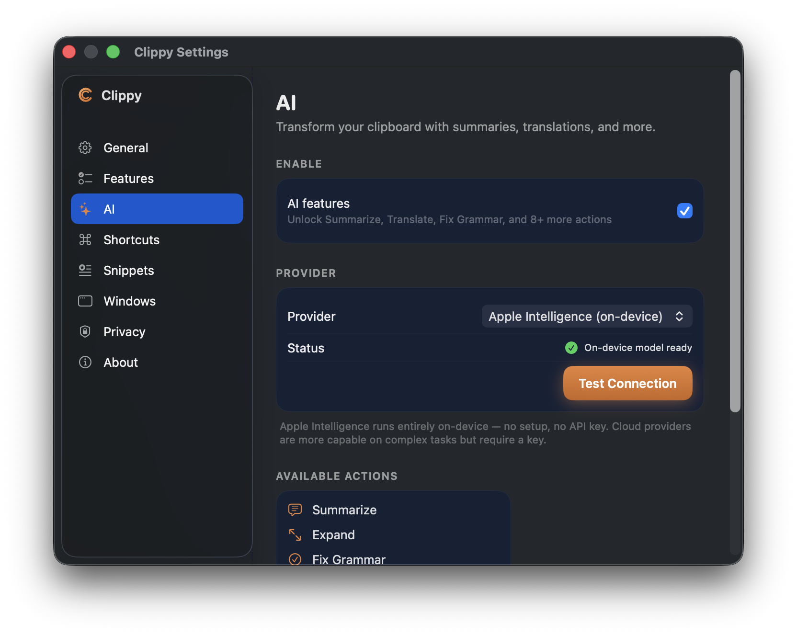
</p>

Yerleşik metin araçları da var: Base64 encode/decode, case dönüşümü,
JSON format/minify, tekrar eden satırları temizle, satır birleştir.

<p align="center">
  
</p>

### Dock Preview & App Switcher

Dock'taki herhangi bir uygulamanın üzerine gelince Windows 11 tarzı
thumbnail'ları gör — numaralı klavye ipuçları, inline başlık çubukları,
ve (opsiyonel) 5 FPS canlı streaming ile.

<p align="center">
  
</p>

### Kendi kendine yazan snippet'ler

Herhangi bir metni bir keyword ile tekrar kullanılabilir snippet olarak
kaydet. Mac'te her yerde `;keyword` yaz — Clippy tetikleyiciyi algılar,
siler ve genişletilmiş içeriği yapıştırır. TextExpander'ın yaptığının
aynısı, yerleşik ve ücretsiz.

<p align="center">
  
</p>

Her snippet'in kendi detay penceresi var: keyword, uygulama kapsamı,
şablon gövdesi ve canlı kullanım istatistikleri (kaç kez tetiklendi,
son ne zaman kullanıldı).

<p align="center">
  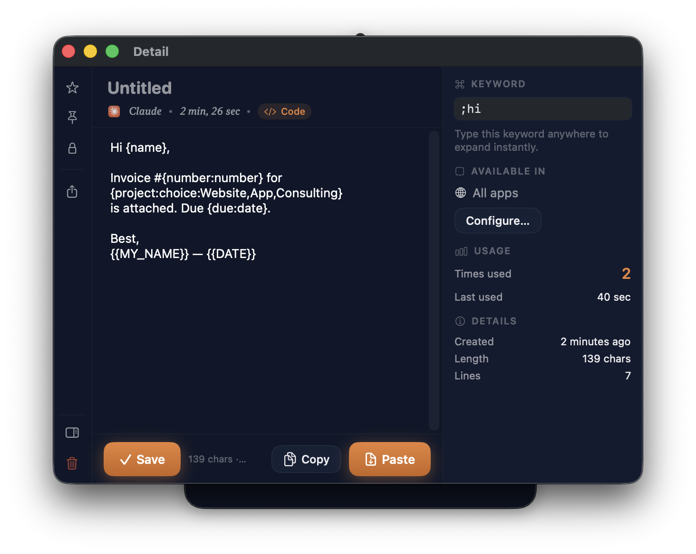
</p>

**Dinamik placeholder'lar** — yapıştırma anında otomatik çözülür:

| Placeholder | Neye dönüşür |
|---|---|
| `{{DATE}}` | Bugünün tarihi, `yyyy-MM-dd` |
| `{{TIME}}` | Geçerli saat, `HH:mm:ss` |
| `{{DATETIME}}` | Birleşik, `yyyy-MM-dd HH:mm` |
| `{{UUID}}` | Yeni rastgele UUID |
| `{{CLIPBOARD}}` | En son panodaki metin |
| `{{RANDOM:1-100}}` | Verilen aralıkta rastgele tam sayı |
| `{{FILE:~/notlar.txt}}` | Yerel dosyanın içeriği |
| `{{SHELL:date +%s}}` | Bir shell komutunun çıktısı |
| `{{BENIM_ADIM}}` | Settings → Snippets'te tanımladığın özel değişken |
| `{{;digeri}}` | Başka bir snippet'i keyword'üyle aç (iç içe, 5 seviyeye kadar) |

**Boşluk doldurmalı parametreler** — yapıştırma anında tek süslü
parantezle küçük bir form aç:

```
Merhaba {isim},

{proje:choice:Website,Mobil Uygulama,Danışmanlık} projesi için
#{numara:number} numaralı fatura ekte. Son ödeme tarihi: {tarih:date}.

{imza=Saygılarımla,\nMehmet}
```

`;fatura` yazınca metin kutusu, sayı girişi, dropdown, tarih seçici ve
önceden doldurulmuş imzayla kısa bir dialog açılır. Alt kısımdaki
canlı **Preview** sen doldururken final metni gösterir. **Paste**'e
bas — her placeholder yerine değer konulup odaklanmış uygulamaya
yapıştırılır.

<p align="center">
  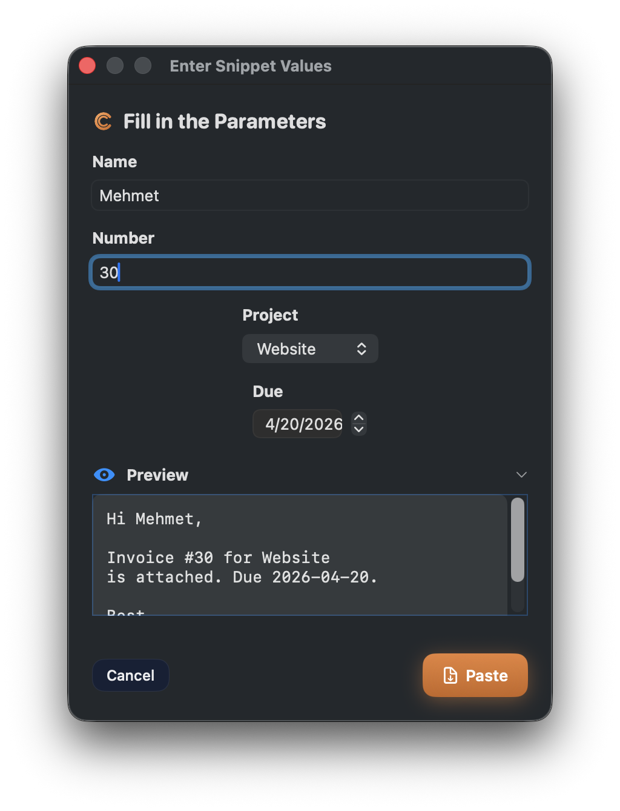
</p>

Desteklenen parametre tipleri:
`{isim}`, `{isim:text}`, `{isim:number}`, `{isim:date}`, `{isim:time}`,
`{isim:choice:A,B,C}`, ayrıca herhangi birine default değer vermek için
`{isim=default}`.

**Global değişkenler** — yeniden kullanılabilir placeholder'ları tek
seferlik **Settings → Snippets → Variables** içinde tanımla
(`{{MY_NAME}}`, `{{MY_EMAIL}}`, `{{MY_COMPANY}}` …) ve her snippet'ten
referans ver. Bir değişkeni değiştir, tüm snippet'ler yeni değeri
otomatik alır.

<p align="center">
  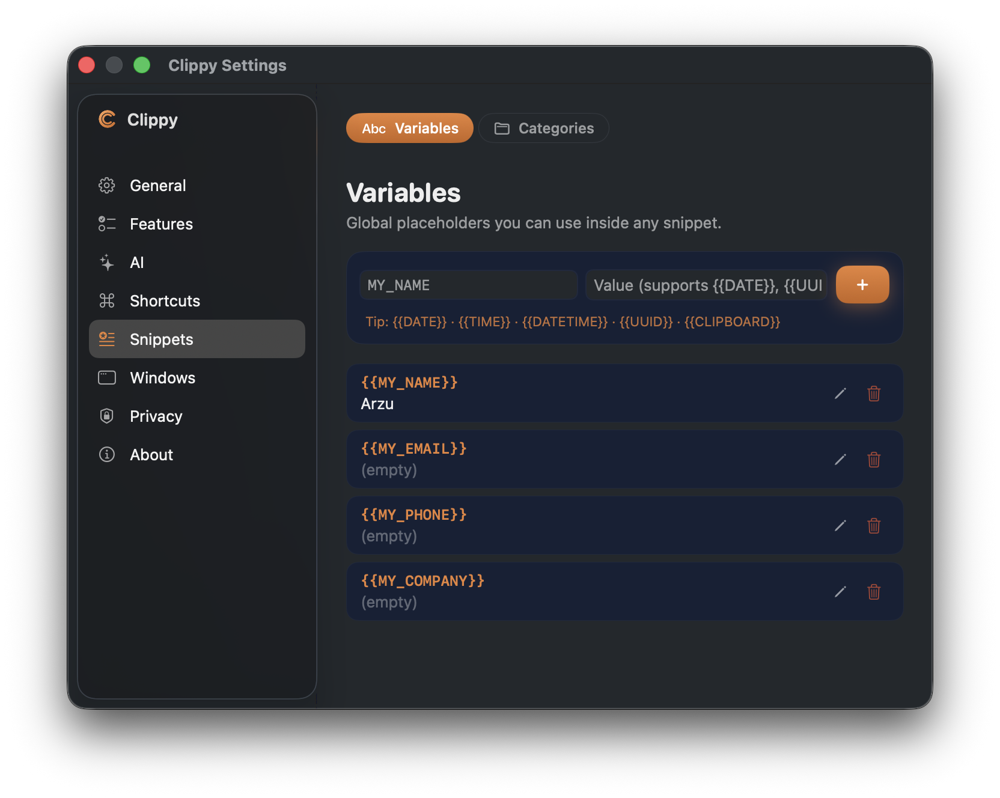
</p>

**Uygulama bazlı kapsam** — bir snippet'i belirli uygulamalara bağla
(ör. Mail + Outlook) ki `;imza` sadece istediğin yerde tetiklensin.

**İç içe kompozisyon** — küçük snippet'lerden daha uzun şablonlar kur
(`{{;selamlama}}` + `{{;imza}}` bir e-posta gövdesinin içinde).

**Kullanım takibi** — Clippy her snippet'in kaç kez tetiklendiğini tutar,
detail inspector'dan güçlü kullananlarını bir bakışta görürsün.

### Canlı arama

Yazarken anında filtreler. Placeholder aktif sekmeye göre değişir
(Search clipboard… / Search snippets… / Search images…) — ne
aradığını her zaman bilirsin.

<p align="center">
  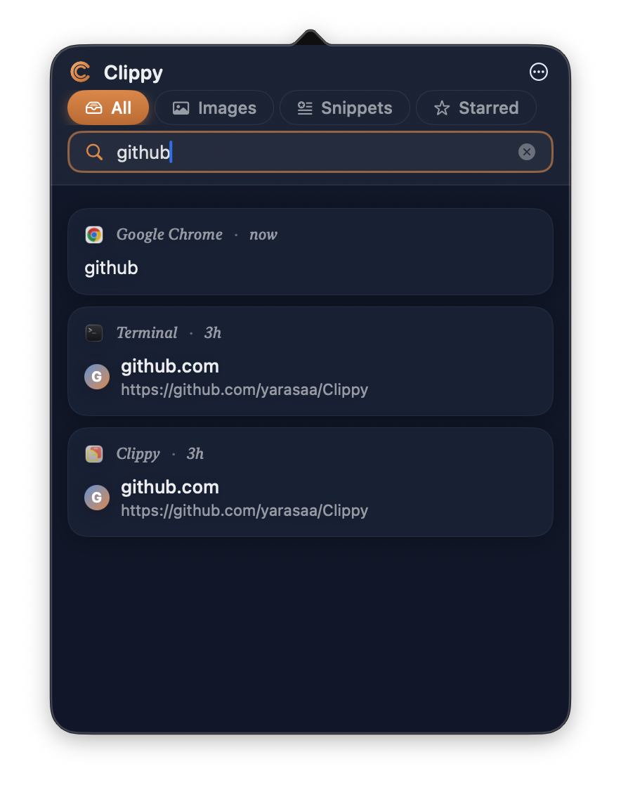
</p>

### Pinli & yıldızlı

Pinli öğeler Recent akışının üstünde kalıcı olarak duruyor — önemli
şeyleri kaybetmek imkansız. Hassas girişler için Clippy'nin
**Encrypted content** öğeleri de pinlenebiliyor.

<p align="center">
  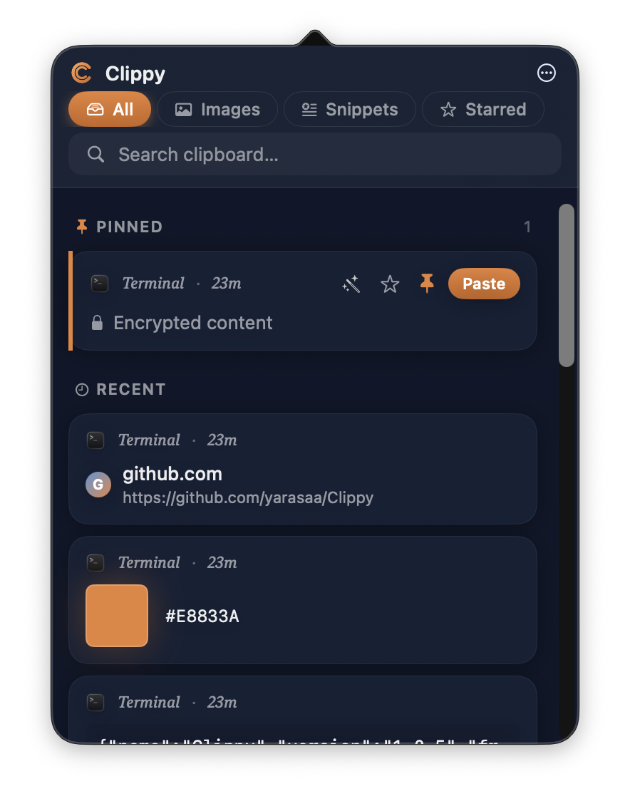
</p>

Uzun süre saklamak istediğin şeyleri yıldızla, Starred sekmesinden sadece
onları gör.

<p align="center">
  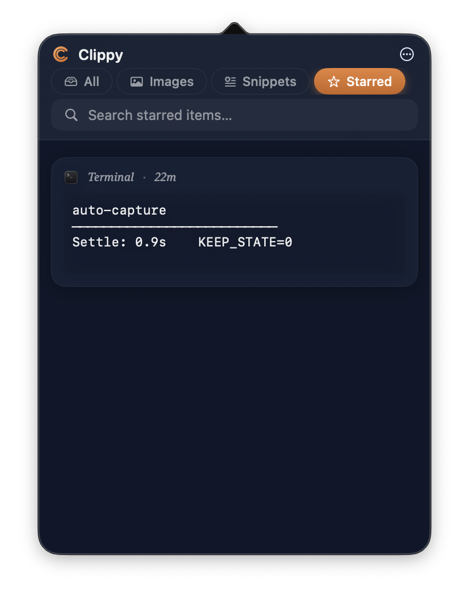
</p>

### İçerik türü filtreleri

Üstteki sekmeler listeyi tek bir içerik türüne daraltır — All,
**Images**, Snippets, Starred.

<p align="center">
  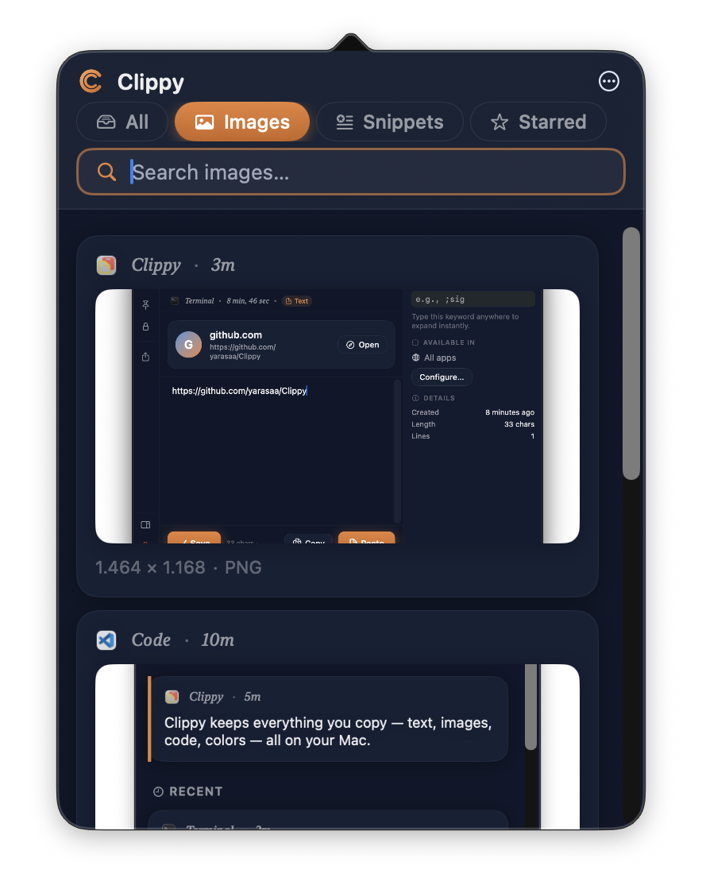
</p>

### Sağ tık güç menüsü

Her kartın zengin bir context menüsü var: copy, paste, share, renk
formatı dönüştür, yıldızla, pinle, şifrele, görselleri birleştir, sil.

<p align="center">
  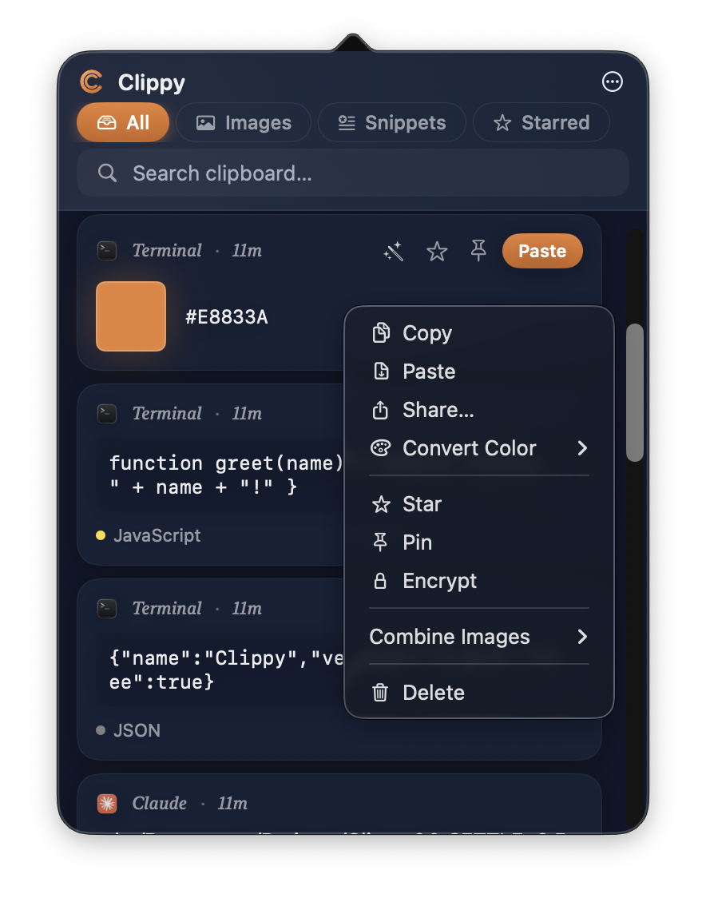
</p>

### Detay penceresi — action rail + inspector

Herhangi bir öğeye tıkla → detay penceresi açılır. Sol: kalıcı action
rail (yıldız, pin, şifrele, paylaş, sil). Orta: zengin editör. Sağ:
bağlama duyarlı inspector (keyword, uygulama scope'u, kullanım
istatistikleri).

<p align="center">
  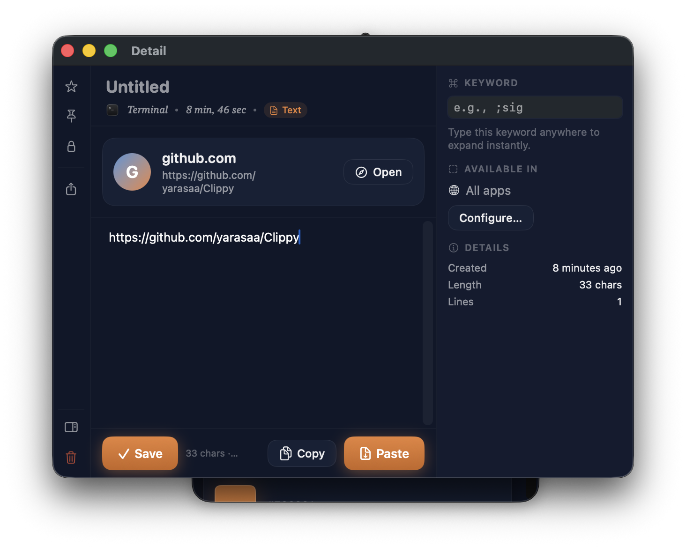
</p>

Farklı içerik türleri farklı muamele görüyor — JSON için ağaç görünümü,
"Valid JSON" rozeti ve Raw toggle'ı var.

<p align="center">
  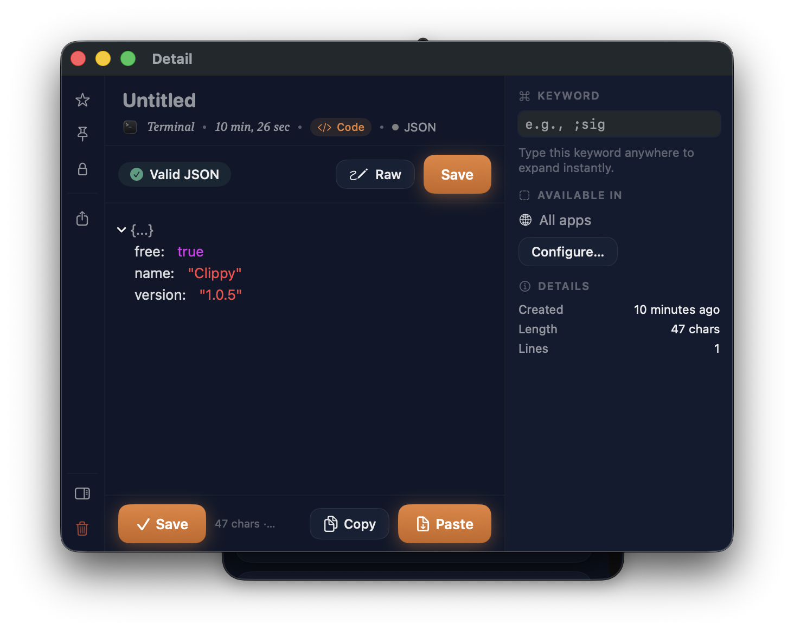
</p>

Renkler için özel bir kart: parlayan swatch + tek tıkla HEX, RGB, HSL
arasında dönüştüren Copy menüsü.

<p align="center">
  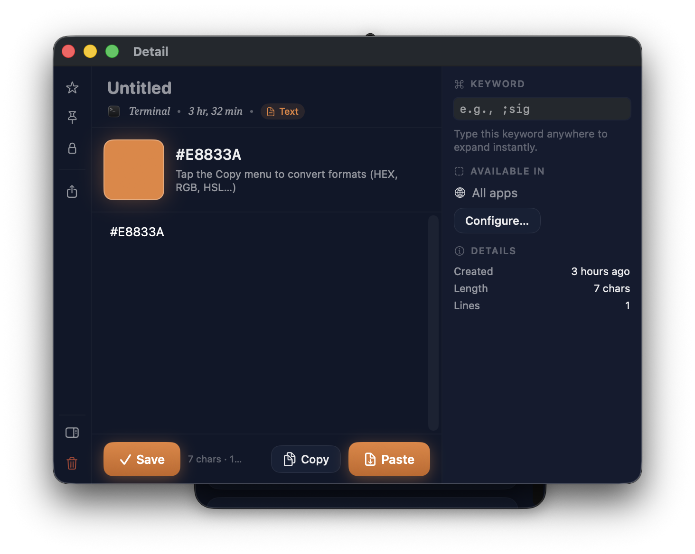
</p>

### 🏷 Otomatik başlıklar

Her öğe kısa ve okunabilir bir başlık alır; geçmişin bir bakışta taranır,
bir URL'nin ilk 40 karakterine bakmak zorunda kalmazsın. Başlıklar
aranabilir ve **Ayarlar → Özellikler**'den tamamen kapatılabilir.

### 🔤 Live Text

Herhangi bir ekran görüntüsünü detay penceresinde aç ve metni **doğrudan görselin üzerinde** seç — tıpkı Fotoğraflar gibi. Kopyala, linklere dokun, tamam. Dil bayrakları neyi algıladığını bir bakışta gösterir.

<p align="center">
  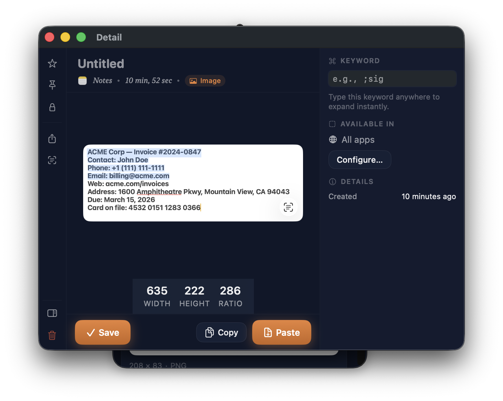
</p>

<p align="center">
  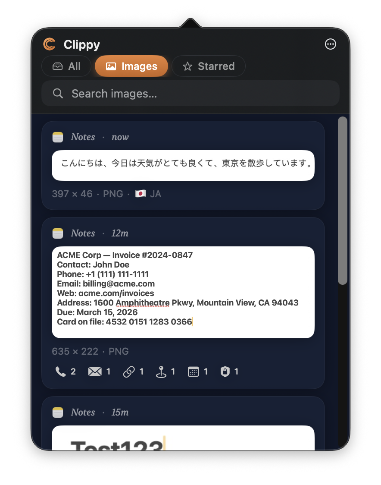
</p>

### 🧩 Şablonlar

Clippy aynı *biçimdeki* metni tekrar tekrar kopyaladığını fark eder —
fatura satırları, ticket referansları, standup notları — ve değişken
parçaları doldurulmuş bir şablona dönüştürmeyi önerir. Hiçbir şey
kaydedilmeden öneriyi gözden geçirirsin; kapattığında Clippy sesini keser.

Örneğin şunlardan birkaçını kopyaladıktan sonra:

```
INV-2026-0142 · Acme Ltd · €1,240.00 · due 2026-08-15
INV-2026-0143 · Globex · €880.00 · due 2026-08-18
```

Clippy, değişen parçaları alana dönüştürülmüş bir şablon önerir:

```
INV-{numara} · {firma} · €{tutar} · due {tarih}
```

### 📱 Telefona gönder

Herhangi bir linke sağ tıkla → **Telefona gönder**. Bir QR kodu çıkar,
kamerayı tut, link orada açılsın. Eşleştirme yok, hesap yok, ağ üzerinden
gidiş-dönüş yok.

<p align="center">
  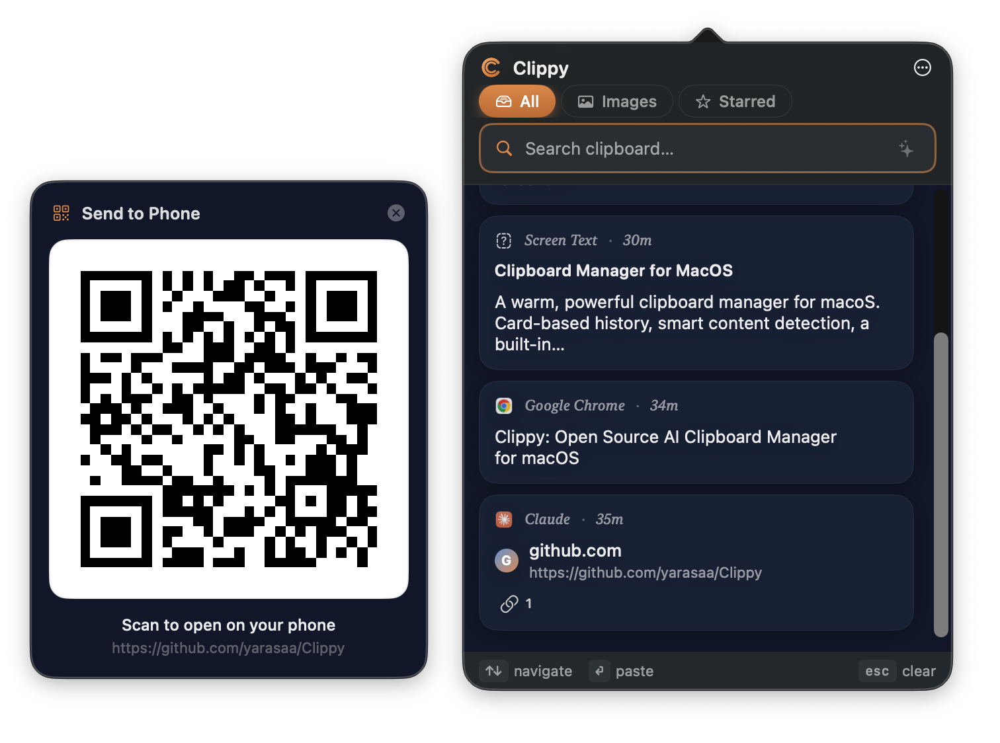
</p>

### Dosya dönüştürücü

Dosyaları sürükle, çıktı formatlarını seç, toplu dönüştür:

- **Görsel:** PNG, JPEG, TIFF, BMP, GIF, HEIC, WEBP, PDF
- **Belge:** RTF, HTML, TXT, PDF, Markdown, DOCX
- **Ses:** M4A, WAV, AAC, AIFF, MP3, FLAC, CAF
- **Video:** MOV, MP4, M4V, AVI
- **Veri:** JSON, YAML, XML, CSV, PLIST

<p align="center">
  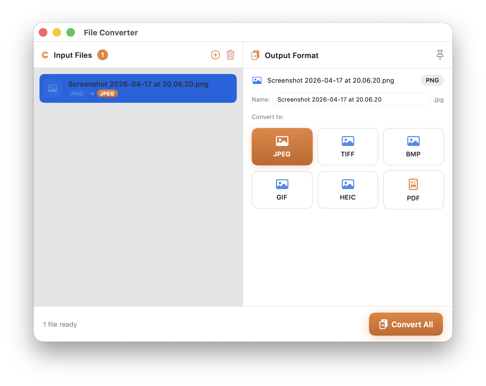
</p>

### Shelf

Uygulamalar arası elinin altında tutmak istediğin dosyalar için özel bir
çekmece — indirilenler, ekler, mockup'lar, PDF'ler. Dosyaları her
yerden Shelf'e sürükle; gerektiğinde geri çek. Tür rozetleriyle
(PDF / ZIP / folder / görsel boyutu) ve toplu eylemlerle listelenir.

<p align="center">
  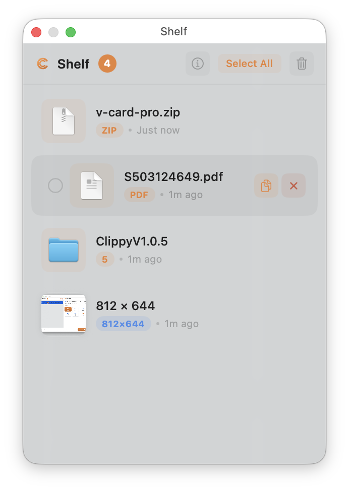
</p>

---

## Ayarlar

Her şey tek bir NavigationSplitView tabanlı Settings penceresinden
yapılandırılabilir — General, Features, AI, Shortcuts, Snippets, Windows,
Privacy, About.

### General

Açılışta başlat, tema, popover boyutu, görünür sekmeler, auto-update
kontrolleri.

<p align="center">
  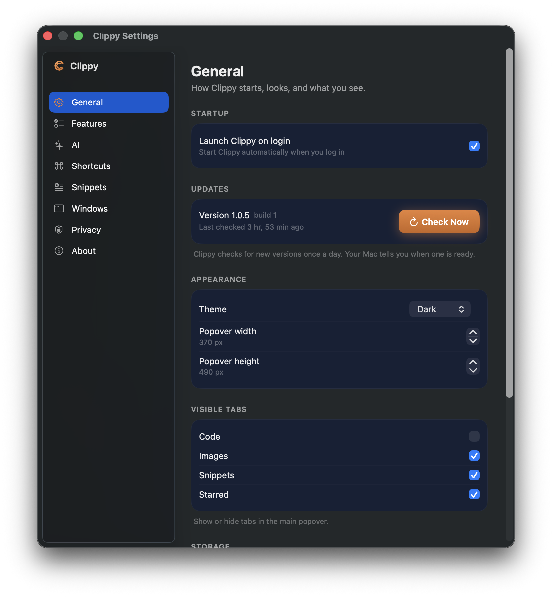
</p>

### Features

İnce ayar: otomatik kod algılama, içerik algılama, duplicate atla,
kaynak-uygulama takibi, ekran editörü, OCR, dosya dönüştürücü, shelf,
Quick Preview.

<p align="center">
  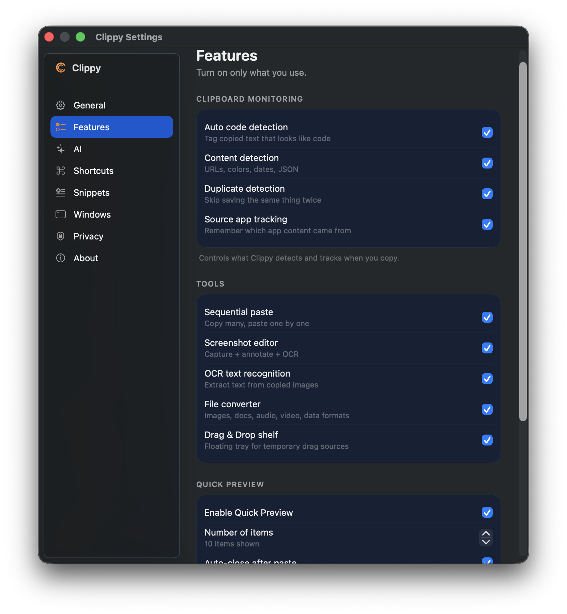
</p>

### AI

Sağlayıcı seç (Ollama, OpenAI, Anthropic, Google Gemini), API key
yapıştır, model seç, bağlantıyı test et. Aşağıdaki available actions
Clippy'nin kartlarında tam olarak ne sunacağını söyler.

<p align="center">
  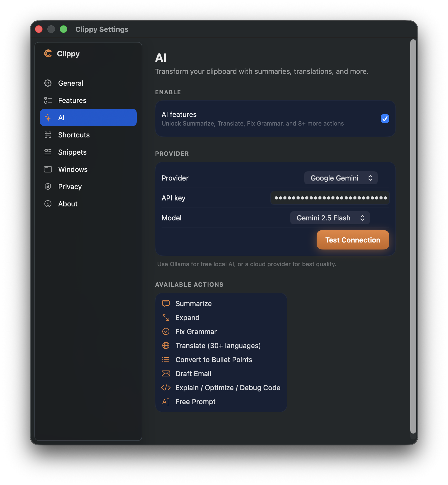
</p>

### Shortcuts

Her kısayolu yeniden bağla — Show/Hide, Paste Selected, Quick Preview,
Sequential Copy/Paste, Clear Queue, Screenshot, App Switcher.

<p align="center">
  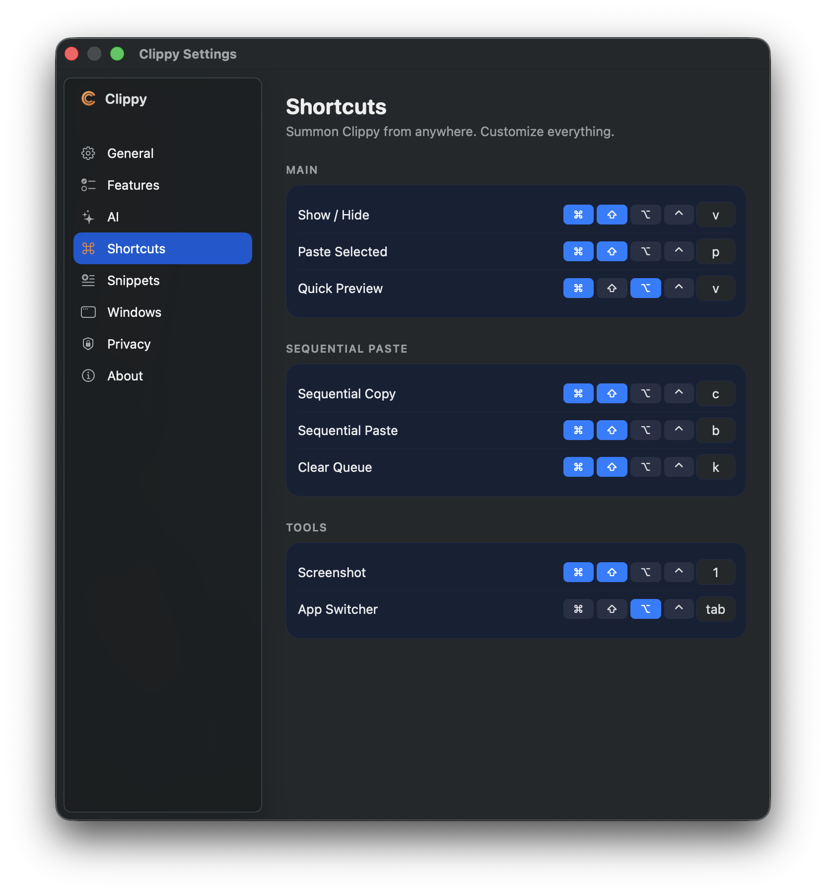
</p>

### Windows (Dock Preview)

Dock Preview'ı ayarla: animasyon stili, önizleme boyutu, hover delay,
trackpad gestures, pencere cache, max cache boyutu.

<p align="center">
  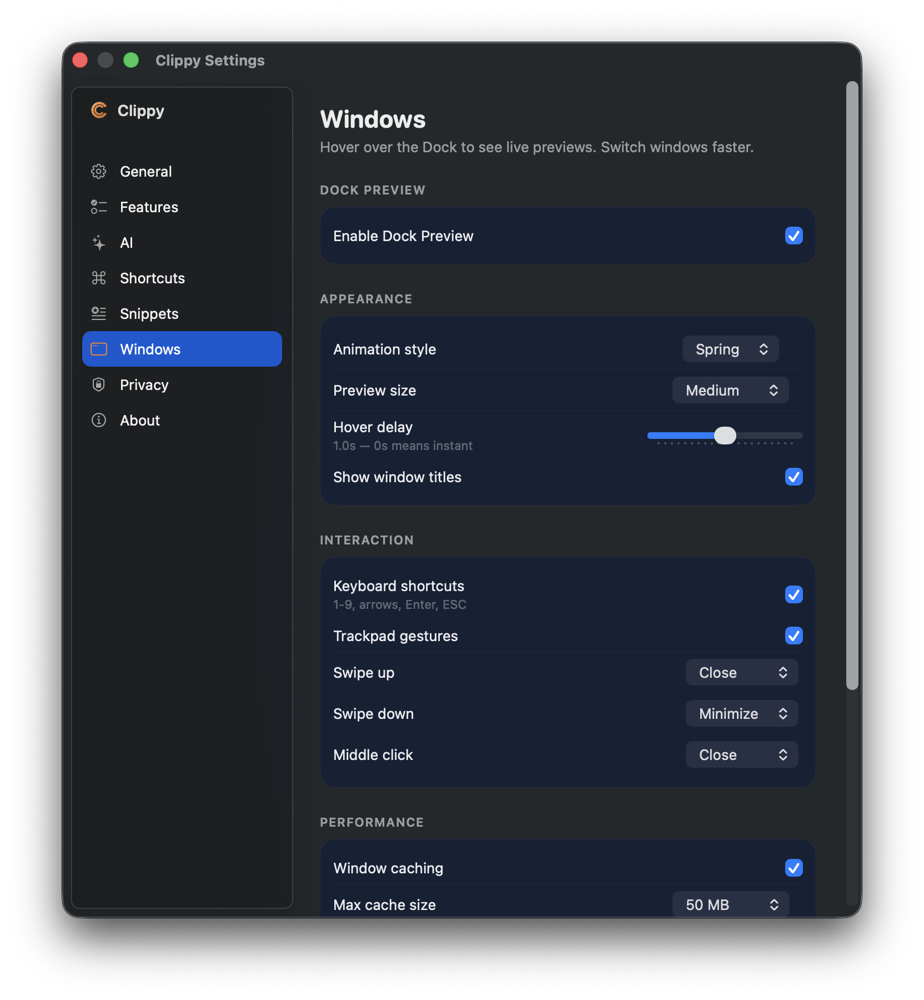
</p>

---

## Kurulum

### DMG indir

1. En son `.dmg`'yi **[Releases](https://github.com/yarasaa/Clippy/releases/latest)** sayfasından al
2. Çift tıkla, **Clippy.app**'ı `/Applications`'a sürükle
3. Aç — kısa bir onboarding kurulumda sana yol gösterir

<p align="center">
  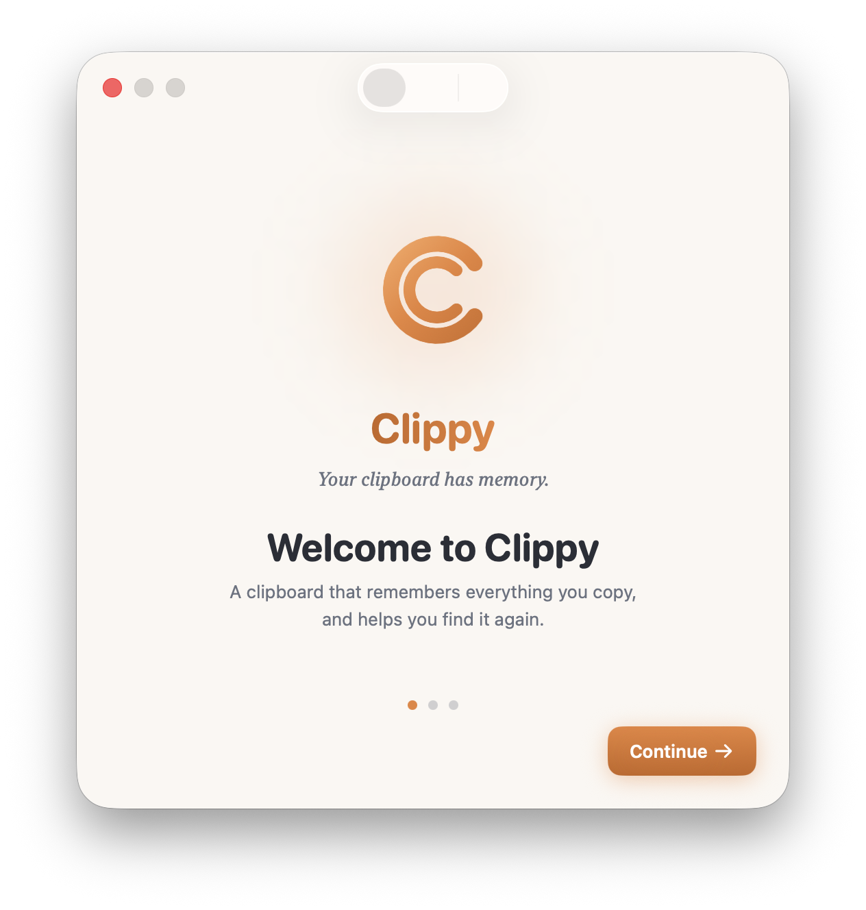
</p>

### Otomatik güncelleme

Clippy [Sparkle](https://sparkle-project.org/) ile geliyor. Yeni sürümler
24 saatte bir arka planda kontrol edilir, veya **Settings → General →
Check Now** ile manuel. Güncellemeler kriptografik olarak imzalanıyor
(EdDSA) — sadece gerçek Clippy senin Mac'ine güncelleme pushlayabilir.

### Kaynaktan derle

```bash
git clone https://github.com/yarasaa/Clippy.git
cd Clippy
open Clippy.xcodeproj
# Xcode'da Product → Run (⌘R)
```

Gereksinimler: macOS 13+, Xcode 16+, Swift 5.9+.

---

## Klavye kısayolları

Hepsi **Settings → Shortcuts**'tan değiştirilebilir.

| Eylem | Varsayılan |
|---|---|
| Clippy popover'ını aç/kapa | `⌘⇧V` |
| Quick Preview overlay | `⌘⌥V` |
| Seçilileri hepsini yapıştır | `⌘⏎` |
| Sequential Copy | `⌘⇧C` |
| Sequential Paste | `⌘⇧V` (override) |
| Ekran görüntüsü al | `⌘⇧S` |
| Ekrandan metin yakala | `⇧⌘2` |
| App Switcher | `⌘⇥` (etkinse) |

### Popover içinde

| Eylem | Tuş |
|---|---|
| Geçmişte gezin | `↑` `↓` |
| Seçili öğeyi yapıştır | `⏎` |
| 1–9 arası öğeyi doğrudan yapıştır | `⌘1`–`⌘9` |
| Arama ve liste arasında odak değiştir | `⇥` |
| Kapat | `esc` |

Popover açıldığında arama odağı kapmaz, bu yüzden numara kısayolları
Clippy görünür görünmez çalışır.

Quick Preview overlay'in kendi nav tuşları var — `1`-`9` ile yapıştır,
`↑↓` gezin, `esc` ile kapat.

---

## Gizlilik

Clippy her şeyi Mac'inde, kullanıcı hesabının altında, CoreData'da saklar.

- **Ağ çağrısı yok**, şunlar hariç:
  - Opsiyonel AI dönüşümler (sadece sen aktifleştirirsen ve sadece
    seçtiğin sağlayıcıya — Ollama tamamen lokal)
  - `raw.githubusercontent.com/yarasaa/Clippy`'e auto-update kontrolleri
- **Analitik, telemetri veya hesap sistemi yok**
- **Kaynak uygulama takibi** Settings → Features'tan kapatılabilir
- **Şifreli öğeler** — hassas pano girişlerini kilitle, kimlik
  doğrulamasına kadar "Encrypted content" olarak görünürler

Tam döküm için [PRIVACY.md](PRIVACY.md) (yakında) bakacaksın.

---

## Katkı

Clippy açık kaynak, katkılar çok kıymetli.

- Bug / özellik istekleri: [GitHub Issues](https://github.com/yarasaa/Clippy/issues)
- Kod katkıları: fork → branch → `main`'e PR
- Büyük değişiklikler: önce issue aç, yönü konuşalım

Yayınlama (sadece maintainer'lar) — [docs/SPARKLE_SETUP.md](docs/SPARKLE_SETUP.md) bak.

---

## Teşekkürler

- **Sparkle** — auto-update framework'ü için
- **HotKey** — global klavye kısayolları için
- **Ollama**, **OpenAI**, **Anthropic**, **Google** — AI erişimi için
- Bug bildiren, build test eden ve Ember yeniden tasarımını itekleyen herkes

## Destek ol

Clippy hayatını kolaylaştırıyorsa, bir kahve devam ettirmeye yeter:

<p align="center">
  <a href="https://buymeacoffee.com/12hrsofficp">
    
  </a>
</p>

---

## Lisans

MIT — [LICENSE](LICENSE) dosyasına bak.
